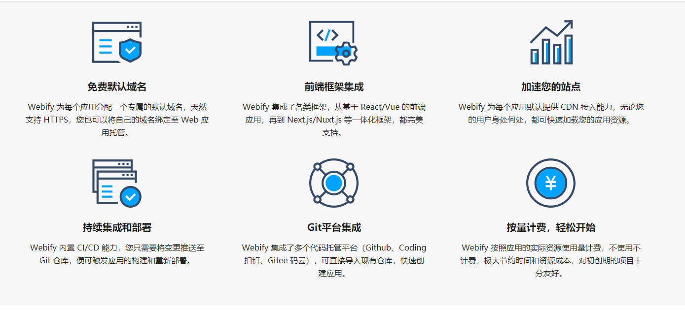
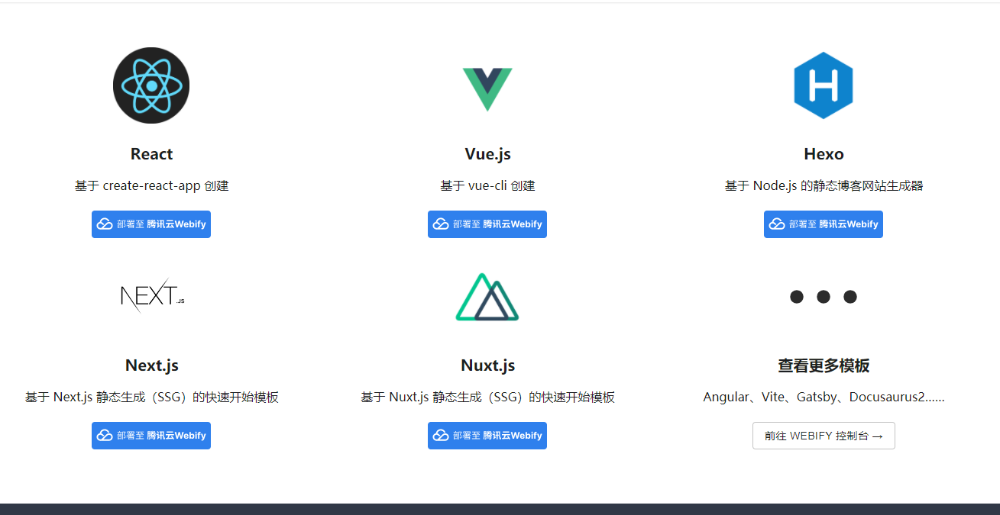

# 云开发

## [云开发 Webify](https://webify.cloudbase.net/)

> 云开发 Webify：专为 Web 开发者打造的应用托管平台，极速开发、部署、上线
>
> [立即开始🚀](https://webify.cloudbase.net/docs/quick-start)[查看文档🔍](https://webify.cloudbase.net/docs/introduction)

### 云开发免费的平台

> * [金华市雪里开网络科技有限公司免费查询系统下载](http://12391.net/)
> * [果创云：YesApi.cn | API接口低代码开发平台](http://open.yesapi.cn/)
