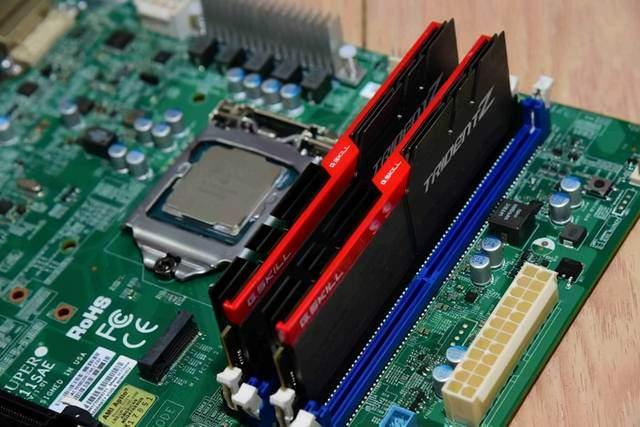
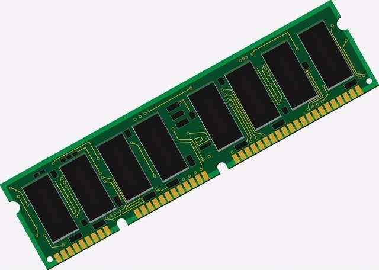
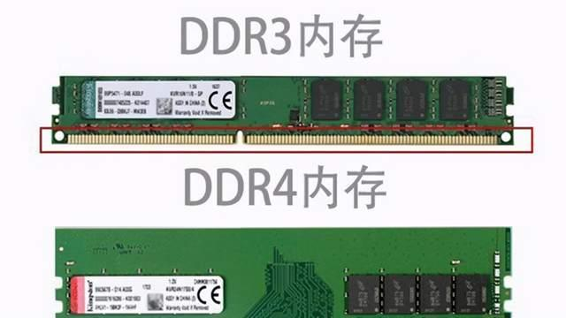
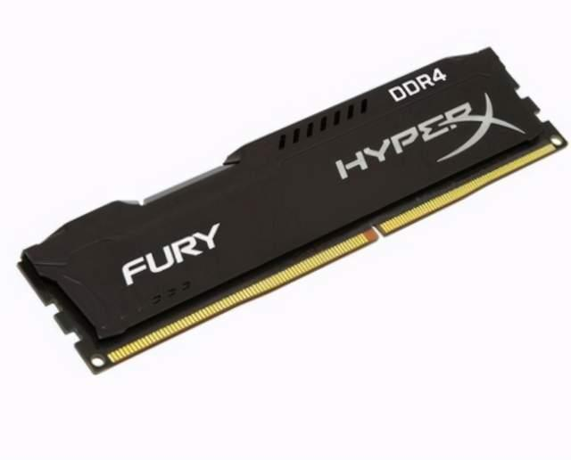
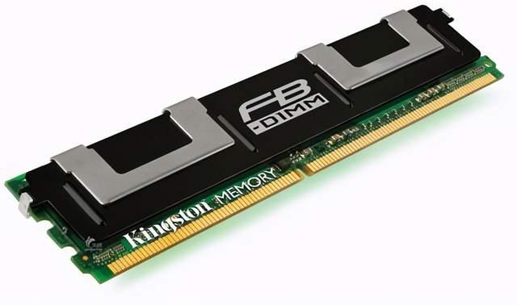

# 三代、四代、五代内存到底有什么区别？就数字不一样？

说到电脑内存条，很多小伙伴都瞬间激动，什么吃鸡要配两根DDR4 8G 3200的条子，什么海盗船、威刚、十铨、三星、金士顿……

什么意思呢？就是说内存品牌众多，而且又分为3代、4代、5代（DDR3、DDR4、DDR5）等，细分又有频率和内存容量的差别，那么到底3代、4代、5代有什么区别呢？

**1、内存条容量不同**

**三代内存条**单根最小内存容量只有**1G**，最大的为**64G**，而且常见的台式机都是16G就打住了，市面上常有的16G和32G服务器内存条，小伙伴们要擦亮眼睛**（一般不通用，但是某些主板兼容的另论，就算兼容也会出现很多错误，时常导致普通电脑蓝屏等状况。)。**

**四代内存条**单根最小容量是**4G**，最大单根容量是**128G。四代内存条可以说是目前市场的主流选择**，容量上已经超越DDR3，而且为了保证产品的卖点，DDR4在外观等方面做足了功夫，为DIY平添活力。

**五代内存条**目前还没有正式进入市场，就最新消息称，DDR5将从单条8G开始起步，最大多少还没有定论。

**2、内存条插口不同**

DDR4作为DDR3的升级版本，金手指（下面插接部分的金色金属部分）做出了改变，那就意味着**DDR3和DDR4不再兼容，需要配DDR4还必须配可以插4代内存条的主板**，**DDR5同理，将不再向下兼容，而且需要支持DDR5的主板**。是不是觉得资本的镰刀无情挥动，一遍遍噶韭菜，内存噶完，主板噶！

**3、内存条功耗**

简单来说就是费电情况，3代内存条比较特殊，有1.25V和1.35V的**低压条，还有1.5V的标压条**。

而4代内存条就显得格外讨人喜欢，只有1.2V的低电压条，虽然电压降低，但性能却提升了。还有超频党就不要抬杠了，我知道你的内存条不只这一个电压（超频就是通过提高供电，从而提高内存条的性能，就像给人吃兴奋剂）。

5代内存条官爆电压1.1V，更节能，但是超频的上限反而更高了，相较DDR4，节能可达30%。

**4、内存频率**

首先内存频率就像你码字速度一样，有的人一分钟能码100字，有的人一分钟能码10个字，那你说老板更爱哪个？

DDR3内存条频率有三种，分别为1333、1600和1866（也就是规定时间最多码1866个字），而DDR4内存条频率显著增加2133起步，包括2400、2666、3000和3200等，明显就是快了，这也是为什么有些老电脑升级时，换了硬盘和内存之后，电脑就起飞的原因，因为真的快了，当然太老的电脑就需要更换主板了。

**DDR5内存条的工作频率将高达4800以上，而且公布的最高频率达到6400MHz**，什么概念？就是单车变摩托，摩托坐宝马的概念，简直就是成倍增长，最重要还是人家DDR5的电压还降低了，理论讲频率越大功耗越高，但制作工艺的进步使得出现这一神奇现象。

总之，内存条升级一直是电脑革命的重要标致，相信五代内存出世之后，新时代的电脑将再度成为再次刷新人们的认知，而且新的软件技术和5GAR等技术都将会更好地体现出来，我们不敢猜测，因为时代发展太快，我们只能佩服的同时，心甘情愿地扯开自己的钱包。有一天，人们突然意识到，当韭菜其实也挺幸福！