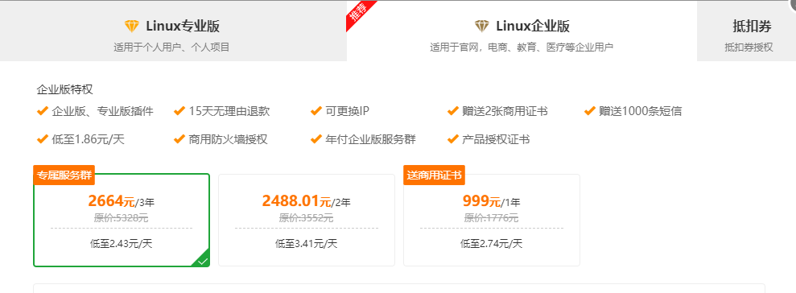
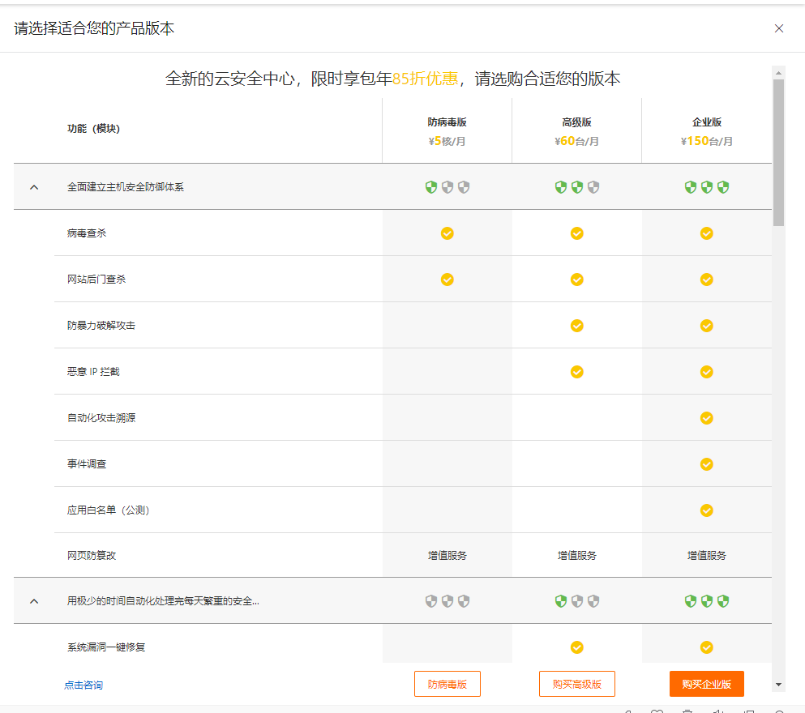
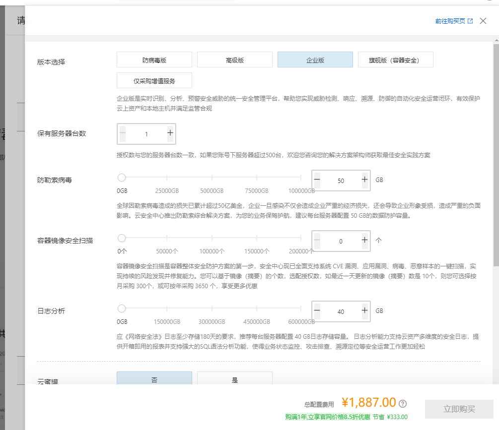

# 安全是个永恒的话题

## 服务器安全服务

| 序号 | 企业名称       | 质量   | 价位（年） |
| ---- | -------------- | ------ | ---------- |
| 1    | 阿里云安全中心 | 最好   | ￥1887     |
| 2    | 青藤云Saas旗舰 | 第二   | ￥2400     |
| 3    | 宝塔企业版     | 较单一 | ￥999      |

### 青藤云安全

[济南青藤云安全](https://www.qingteng.cn/)

### 宝塔企业版

仅支持Nginx防火墙。  [点我跳转宝塔页面](https://www.bt.cn/new/pricing.html)

### 阿里云安全企业版

见官网。

