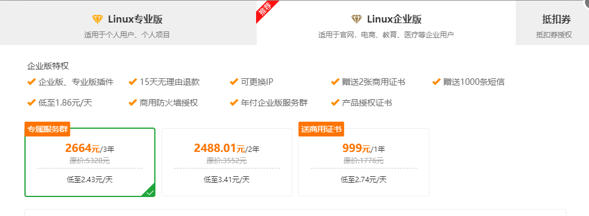
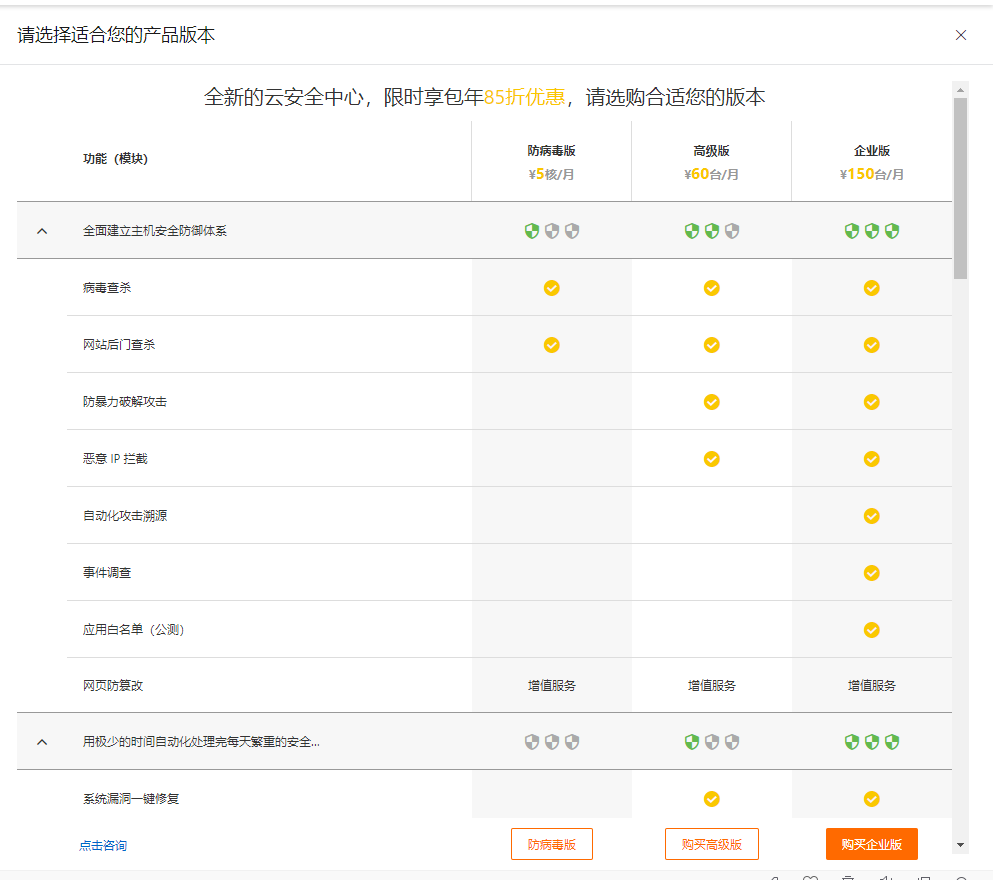
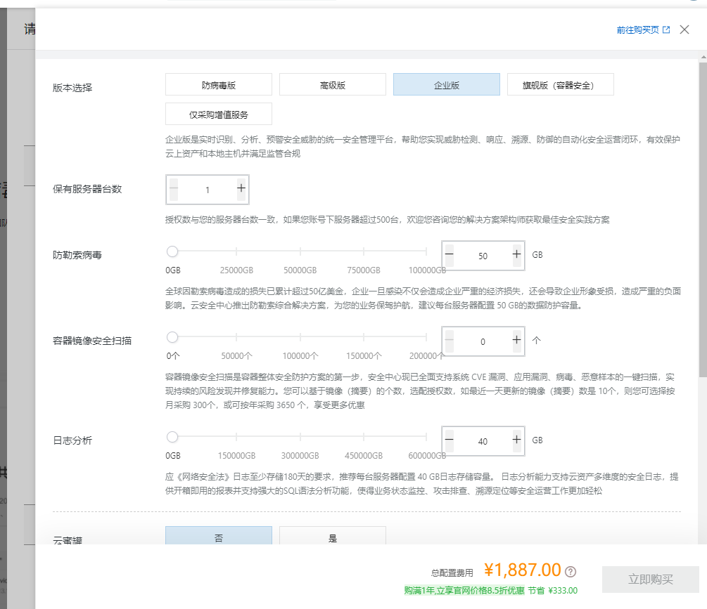

# 安全是个永恒的话题

[小迪教程网](http://www.xiaodi8.com/)

## Linux服务器简单的安全策略

> 简单的服务器安全策略，不断完善中。

### 如何保护我们的服务器？

1. 勤改密码，并保证密码的复杂性。
2. 仅在维护期间开机SSH端口。
3. 设置云服务器的安全组的白名单。

### 如何禁止国外的IP，扫描服务器？

1. 所有国外的IP一律禁止访问
2. 恶意访问不存在的网址的IP,通过关键词触发，直接屏蔽
3. IP访问频率限制，超出阈值，直接屏蔽24小时
4. 通过Shell防火墙脚本，设置为仅仅允许国内IP访问。

## 服务器安全服务提供商

| 序号 | 企业名称                     | 质量   | 价位（年） |
| :--: | :--------------------------- | ------ | ---------- |
|  1   | 阿里云安全中心               | 最好   | ￥1887     |
|  2   | 青藤云Saas旗舰（感觉不太行） | 第二   | ￥2400     |
|  3   | 宝塔企业版                   | 较单一 | ￥999      |
|  4   | 安全狗                       | 不详   | 不详       |

### 青藤云安全

[济南青藤云安全](https://www.qingteng.cn/)

### 宝塔企业版

仅支持Nginx防火墙。  [点我跳转宝塔页面](https://www.bt.cn/new/pricing.html)

### 阿里云安全企业版

见官网。

### 安全狗

每月￥3500

https://www.safedog.cn/index/cloudEyeIndex.html