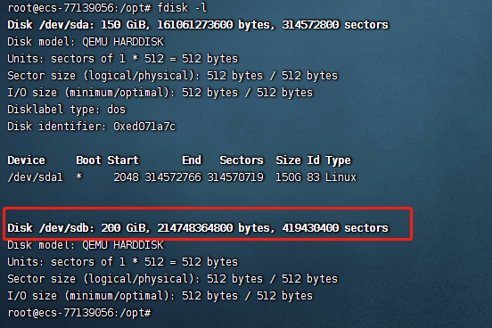
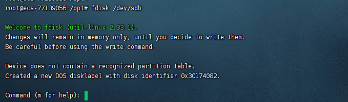
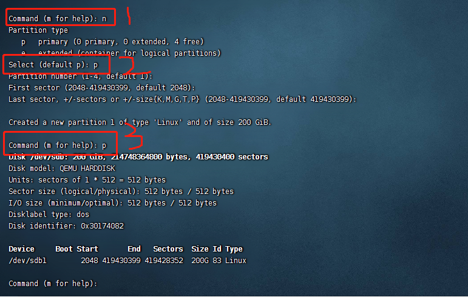
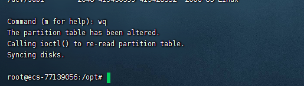
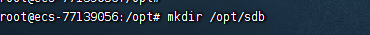
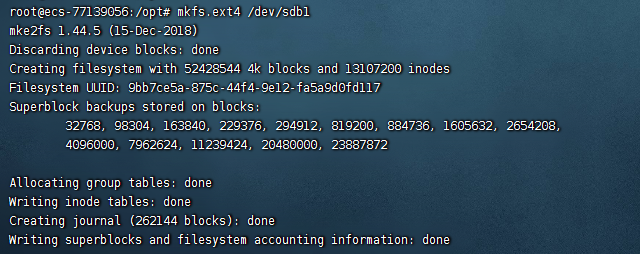
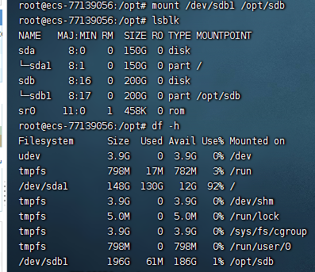
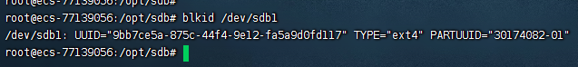
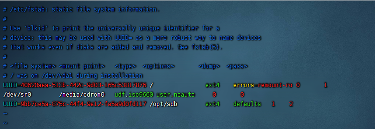

## 关于硬盘挂载的操作

### 1.确认当前云主机是否挂载上新硬盘

```shell
fdisk -l
```




### 2.对硬盘进行初始化

#### 1.创建分区

fdisk /dev/sdb



三步操作：



1. 创建分区指令：n
2. 创建一个主分区：p
3. 查看分区指令：p


输入wq进行保存




#### 2.创建挂载点




#### 3.磁盘格式化

对盘符进行格式化，将其格式化为ext4文件系统，执行指令mkfs.ext4 /dev/vdb1。

指令执行之后界面提示done信息，表示格式化执行完毕




#### 4.磁盘挂载到挂载点位置

将云硬盘mount到指定位置：执行指令#mount /dev/vdb1 /opt/tmp ，执行完成之后输入df -h查看分区，上面出现数据盘信息，说明当前挂载成功，用户可以使用该新分区了。





### 3.配置磁盘挂载信息重启后生效

用户使用mount操作将云硬盘挂载成功，但是重启云主机之后，挂载信息丢失，为了保证挂载信息长期有效，用户需要进行fstab文件配置，具体操作如下：

1. 用户输入“blkid /dev/vdb1”指令获取需要操作盘的UUID信息。



2. 用户输入“vim/etc/fstab”进入fstab文件的编辑页面。

3. 用户在文件中添加”UUID=9bb7ce5a-875c-44f4-9e12-fa5a9d0fd117 /opt/sdb ext4 defaults 1 2”。


