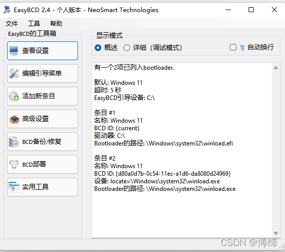

# MacOs系统的一些用法

## Windows与黑苹果双系统？

> 引用语：待编辑

#### 第一步：系统分区

#### 第二步：制作U盘与安装系统

#### 第三步：脱离U盘启动


没有用明白的驱动软件，如果有人会用，请教教我。



#### 参考

https://win2mac.top/eeb1bf86.html ：老吴快速安装黑苹果恢复版（收费）

https://www.mfpud.com/topics/2111/ ：黑苹果系统安装通用教程图文版

https://heipg.cn/tutorial/gpu-support-for-hackintosh.html：2022年黑苹果macOS Big Sur/Monterey显卡支持列表，持续更新中。


## Mac系统关于Homebrew的使用

### 如何安装?

[参考这篇](https://zhuanlan.zhihu.com/p/111014448)

### 如何使用？

初步介绍几个brew命令
本地软件库列表：brew ls
查找软件：brew search google（其中google替换为要查找的关键字）
查看brew版本：brew -v  更新brew版本：brew update
安装cask软件：brew install --cask firefox 把firefox换成你要安装的
    
 重启终端 或者 运行 source /Users/jacky/.zprofile   否则可能无法使用


## 系统维护

#### 双系统：黑苹果window时间不同步

文章概述:

> 双系统中windows经常出现时间不准确：通过每次开机自动从网络获取时间地址 来解决这个问题。


cmd执行

```Cmd
Reg add HKLM\SYSTEM\CurrentControlSet\Control\TimeZoneInformation /v RealTimeIsUniversal /t REG_DWORD /d 1
```


#### 如何在mac上安装md5校验文件

1、更新brew

```Shell
ruby -e "$(curl -fsSL https://raw.githubusercontent.com/Homebrew/install/master/install)"
```

2、安装md5

```Shell
brew install md5sha1sum
```

3、命令行md5校验

```Shell
md5sum 文件名
```


