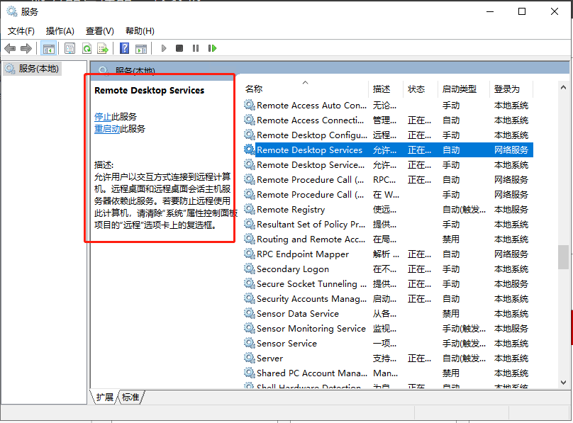

# WinServer如何修改3389端口呢？

## WinServer 2019举例子

时间  2022年8月6日

参考文档:  [修改3389端口](https://www.likecs.com/show-479540.html)     [重启远程登录服务](https://blog.csdn.net/JianguoChow/article/details/124000646?spm=1001.2101.3001.6661.1&utm_medium=distribute.pc_relevant_t0.none-task-blog-2~default~CTRLIST~default-1-124000646-blog-115483088.pc_relevant_multi_platform_whitelistv3&depth_1-utm_source=distribute.pc_relevant_t0.none-task-blog-2~default~CTRLIST~default-1-124000646-blog-115483088.pc_relevant_multi_platform_whitelistv3&utm_relevant_index=1)

### 一、修改3389远程端口

#### 　　1、打开注册表

​			按”win+r"快捷键，在对话框中输入regedit

#### 　　2、找到对应路径

```tex
# 修改3389远程登录端口
\HKEY_LOCAL_MACHINE\SYSTEM\CurrentControlSet\Control\TerminalServer\Wds\rdpwd\Tds\tcp
\HKEY_LOCAL_MACHINE\SYSTEM\ControlSet001\Control\TerminalServer\WinStations\RDP-Tcp
```

#### 		3、修改端口信息

​				下面的 **PortNumber** 选择 十进制 修改

### 二、防火墙

#### 　　1、打开注册表

​			按”win+r"快捷键，在对话框中输入regedit

#### 　　2、找到对应路径

```te
# 注册表路径
\HKEY_LOCAL_MACHINE\SYSTEM\CurrentControlSet\Services\SharedAccess\Defaults\FirewallPolicy\FirewallRules
```

#### 		3、修改对应端口信息	

```Tex
#修改下面两项的Lport=  为新端口
RemoteDesktop-UserMode-In-TCP
RemoteDesktop-UserMode-In-UDP
```

#### 		4、防火墙将出站，入站  

　　防火墙出站，入站 加入端口号   暂时没有时间整理，先粘贴这一项，[跳转](http://www.wjhsh.net/jinanxiaolaohu-p-10231303.html)

### 三、重启远程控制服务

​		重启下面进程

