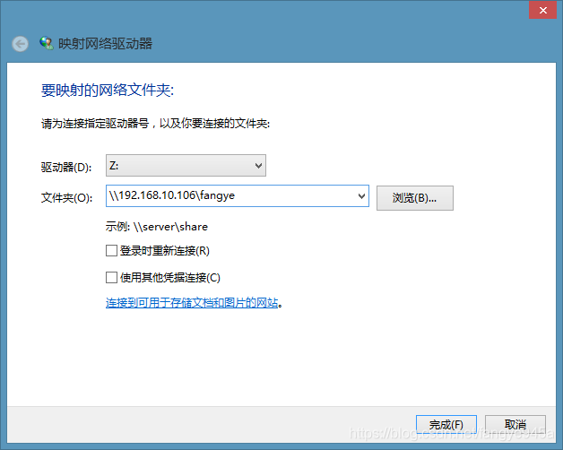
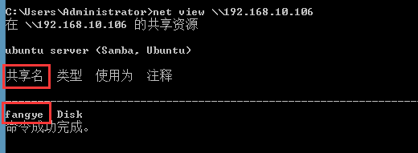

# Win使用cmd映射网络驱动器


 在项目开发中，经常要进行linux虚拟机和windows文件共享，而linux虚拟机通常采用samba共享的方式来与windows交互。当linux搭建并启动samba服务后（搭建samba共享服务，可参考：https://blog.csdn.net/fangye945a/article/details/85142836），windows需要将linux共享的目录映射到本地网络驱动器，这样就能像访问本地磁盘一样来访问共享文件了。如下图所示：


而今天学习的是如何用dos命令来实现这一操作：


## 1、查看共享网络

```shell
net view \\192.168.10.106
```

其中192.168.10.106为进行[samba](https://so.csdn.net/so/search?q=samba&spm=1001.2101.3001.7020)共享的linux虚拟机的IP，执行完毕后可看到存在共享资源，且共享名为fangye。



## 2、映射网络驱动器到本地Z盘

```shell
net use Z: \\192.168.10.106\fangye
```


## 3、断开网络映射

```
net use Z: /del
```


## 4、重置所有网络驱动器

```shell
net use * /d /y
```