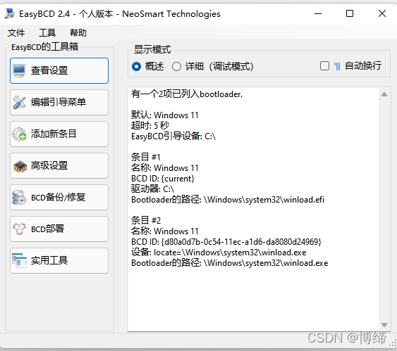

# Windows、linux、mac黑苹果

## 服务器可以搭建的服务

[运维能力：web服务器（nginx、apache、Caddy2）](Note/TechN/ywshow/webserver.md)


## Windows桌面系统

[CMD命令符如何使用](Note/other/cmd.md)

[Windows计划任务每天定时执行程序](https://zhuanlan.zhihu.com/p/430602325)

## 各个桌面、服务器系统镜像下载地址

http://isoredirect.centos.org/centos/7/isos/x86_64/

[mirror.nsc.liu.se镜像源](http://mirror.nsc.liu.se/CentOS/)
[阿里镜像源](http://mirrors.aliyun.com/centos/7.9.2009/isos/x86_64/)

 [Windows我告诉你，系统激活镜像站](https://msdn.itellyou.cn/) 

 [系统激活下载网站](http://www.aichunjing.com/jhgj1/) ：批处理激活脚本 KMS_VL_ALL_AIO v46 中文版、 KMS激活工具 HEU KMS Activator v24.6.1、激活工具合集 KMS Tools Portable 20220201  等等。

```tex
Centos 6系列全版本下载
下面是下载网址进入后选择版本号，选择系统目录文件夹isos，在选择X86_64（就是64位）或者i386（就是32位），进入后就看到了，复制到迅雷下载即可。

主站：http://vault.centos.org/
http://linuxsoft.cern.ch/
http://archive.kernel.org/centos-vault/
rsync://archive.kernel.org::centos-vault/
http://linuxsoft.cern.ch/centos-vault/
rsync://linuxsoft.cern.ch/centos-vault/
http://mirror.nsc.liu.se/centos-store/
rsync://mirror.nsc.liu.se::centos-store/
 

CentOS 和红帽系统的最大不同在于
    CentOS完全免费，不存在红帽系统中需要系列号的问题；
    CentOS支持在线升级，不需要像红帽系统那样购买支持服务； 

总之一句话，CentOS源自RHEL，在其基础上进行适当的优化，并提供免费服务。

CentOS 系统版本介绍
    安装CentOS系统时，无论哪个版本，官方都会提供多种映像文件，大体分为以下几类：

liveDVD版：DVD镜像，无需安装系统，插入光盘就可以体验 CentOS 的各种功能。
liveCD版： CD光盘映像，和liveDVD一样，唯一的区别就是该版本中包含的软件包会少一点，安装系统时使用 U 盘或者CD光盘进行安装。
bin：完整版，由于整个系统安装文件过大，所以一般会分为多个小文件，在下载时需全部下载。
bin-DVD版：该版本就是一个普通的安装版本，本身文件就比较大，包含了大量的常用软件。
minimal版：该版本同bin-DVD相似，不同之处在于该版本只包含有系统必须的几个基本软件包。
netinstall版：该版本也同 bin-DVD相似，不同在于netinstall的软件包全部需要通过网络下载进行安装。
CentOS 更多的是用于服务器上，也有桌面版本，安装系统时，可根据自己的需要，选择合适的映像。安装映像版本解析DVD版,假若你不清楚用哪个映像，就选择DVD版本映像，此版本可以让你选择需要安装的组件，并包含所有在图像安装界面内可选择的组件。
Everything版   everything 映像内收录了 CentOS-7 提供的所有组件，包括那些不能通过安装程序直接安装的组件。
LiveGNOME版   该版本允许你通过以DVD或USB开机的方式来测试CentOS系统。你可以将live映像上的系统安装到映像，但是此版本会安装live映像内包含的所有的组件。
LiveKDE版    KDE桌面版，此版本同GnomeLive版本类似。
Minimal版
NetInstall版        网络安装镜像。
```

## 系统激活工具

 [rufus轻松创建启动盘](http://rufus.ie/zh/) ： Rufus此工具也是用于SD或U盘烧写，通常用于制作***\*windows、Ubuntu、Centos\****的U盘系统安装盘，以及制作PE启动的U盘等等，具体情况看你选择刷入的ISO（此软件为github开源软件）。

[Win32DiskImager](https://win32diskimager.org/) ：此实用工具的主要功能是来写img文件到SD和U盘中，只要运行Win32DiskImager工具，填入自己的img，然后选择移动设备写入即可，通常用于烧写嵌入式linux U盘启动的bin或img（软件为绿色版已经被我打包为单文件版本）

## 关于nginx的配置方式

nginx中，有这么个需求，一个域名二级泛解析到某一个服务器上，想设置某几个网站单独访问一个目录，然后其他的依旧走之前的泛解析，如何操作的呢，就是通过if判断$host 的访问的域名，如果是既定的，就指定规定的路线。

```Shell
# 如果泛解析中域名为指定域名，就被跳转到某一个
if ($host = 'vphp.xxx.com' ) {
        rewrite ^/(.*)$ https://www.jb51.net/$1 permanent;
    }
```


### 参考文献
[nginx泛域名解析基础讲解](https://www.liuvv.com/p/d039.html)
[nginx中域名、目录的301重定向配置示例](https://www.jb51.net/article/52570.htm)


阿里云的云教程

https://developer.aliyun.com/adc/?spm=a2c6h.26020838.J_5404914170.24.10d12d294gNI8m

阿里云的日志采集服务，优化智联招聘，服务器的性能

https://developer.aliyun.com/adc/scenario/5e1aca8e9cd14965a6e84ca5cf2fefd0

linux压缩文件夹命令 tar_每天一个Linux系统命令｜tar

https://blog.csdn.net/weixin_39900286/article/details/110813299?spm=1001.2101.3001.6650.3&utm_medium=distribute.pc_relevant.none-task-blog-2%7Edefault%7ECTRLIST%7Edefault-3.pc_relevant_default&depth_1-utm_source=distribute.pc_relevant.none-task-blog-2%7Edefault%7ECTRLIST%7Edefault-3.pc_relevant_default&utm_relevant_index=6

## Linux

[linux服务器](linux.md)

## WindowsServer

[Windows Server相关](WinServe.md)

## VC++微软全家桶

http://dreamcast2.ysepan.com/

[微软常用运行库合集 v2022.04.09 最新版](https://www.downg.com/soft/42101.html#down) 下载地址

## Windows与黑苹果双系统？

> 引用语：待编辑

#### 第一步：系统分区
#### 第二步：制作U盘与安装系统
#### 第三步：脱离U盘启动


没有用明白的驱动软件，如果有人会用，请教教我。



#### 参考
https://win2mac.top/eeb1bf86.html


## Mac系统关于Homebrew的使用
### 如何安装?
[参考这篇](https://zhuanlan.zhihu.com/p/111014448)

### 如何使用？

初步介绍几个brew命令
本地软件库列表：brew ls
查找软件：brew search google（其中google替换为要查找的关键字）
查看brew版本：brew -v  更新brew版本：brew update
安装cask软件：brew install --cask firefox 把firefox换成你要安装的
    
 重启终端 或者 运行 source /Users/jacky/.zprofile   否则可能无法使用


## 系统维护

#### 双系统：黑苹果window时间不同步

文章概述:

> 双系统中windows经常出现时间不准确：通过每次开机自动从网络获取时间地址 来解决这个问题。


cmd执行

```Cmd
Reg add HKLM\SYSTEM\CurrentControlSet\Control\TimeZoneInformation /v RealTimeIsUniversal /t REG_DWORD /d 1
```


#### 如何在mac上安装md5校验文件

1、更新brew

```Shell
ruby -e "$(curl -fsSL https://raw.githubusercontent.com/Homebrew/install/master/install)"
```

2、安装md5

```Shell
brew install md5sha1sum
```

3、命令行md5校验

```Shell
md5sum 文件名
```


