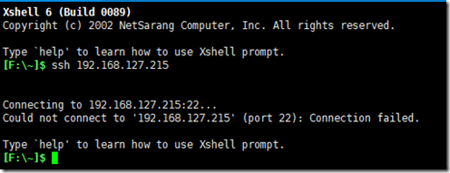
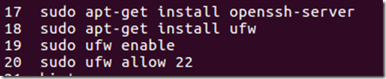
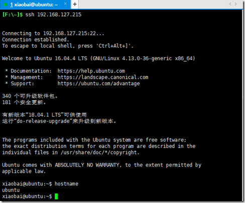

# Linux

[docker的安装](docker.md)

[Centos7安装](https://blog.csdn.net/weixin_46818279/article/details/112132139)


### 搭建lamp，lnmp环境

centos系统搭建lamp，搭建php与python 的api

服务器关闭安全组策略中的防火墙。
https://lnmp.org/  使用一键搭建助手，就是太慢了，2h2g得半个小时。
搭建完成后，php删除 禁止执行的system函数
python脚本安装  pip库文件，设置py文件的权限为777 。


### VMware中Ubuntu 无法进行SSH连接，开启22端口

3、 进入Ubuntu 查看22 端口的情况，发现22端口并未开启

　　命令：netstat -ntlp|grep 22




4、 打开SSH服务，开启22端口，执行以下命令




 5、再次尝试进行XShell连接，发现连接成功，这里使用的是普通用户进行连接，若要使用root用户进行连接，则需要修改SSH配置信息，具体方法参考上篇文章中关于SSH的配置


 


### Centos7 切换图形/字符界面

```shell
# 最后输入如下命令设置开机启动图形界面
	systemctl set-default graphical.target 

# 同理，如果想开机启动dos界面，就输入如下命令
	systemctl set-default multi-user.target 
```


### CentOS7下图形配置网络的方法[nmtui]

今天小编为大家带来的是CentOS7下图形配置网络的方法；希望对大家会有帮助，有需要的朋友一起去看看吧

```shell
# Prerequisite
1.Linux CentOS 7
操作实例
1.安装network manage
yum install nm-connection-editor
2.启动GUI配置界面进行配置
nmtui
3.重启网络服务
service network restart
```


### 安装ab测试工具（ab: command not found）

```shell
yum -y install httpd-tools


nginx压力测试方法：
#ab命令
#安装ab
#Centos系统
yum install apr-util
#Ubuntu系统
sudo apt-get install apache2-utils
 
#ab命令的参数
-n //在测试会话中所执行的请求个数。默认为1
-c //一次产生的请求个数。默认为1
-t //测试所进行的最大秒数。默认值为50000
-p //包含了需要的POST的数据文件
-T //POST数据所使用的Content-type头信息
 
#实例
ab -c 1000 -n 5000 http://www.baidu.com/
每次发送1000并发的请求数，请求数总数为5000。
 
------------------------------------------------------------------------------
#nginx防止被压力测试的设置方法：
#限制同一IP并发数最大为10
vim /etc/nginx/nginx.conf
http{}字段第一行添加：
limit_conn_zone $binary_remote_addr zone=one:10m;
vim /etc/nginx/conf.d/default
server{}字段添加：
limit_conn one 10;
 
#重启nginx
service nginx restart
 
#如出现这种错误提示，表明nginx.conf中的limit_conn_zone $binary_remote_addr zone=one:10m;
#没有添加到正确的区域，最后添加在http字段的第一行。
the size 10485760 of shared memory zone "one" conflicts with already declared size 0 in /etc/nginx/nginx.conf:33

```


### CentOS下SSH默认端口22修改成其他端口

```shell
# centos7
 [访问链接](https://www.cnblogs.com/litexce/p/10948543.html) 

SSH默认端口22大家都知道了这样对于服务器网站的安全其实是非常的不利的，为了让网站更安全我们可以修改SSH默认端口22为其它端口了，下面我们来看具体的修改步骤

方法/步骤
 修改配置文件：/etc/ssh/sshd_config ，找到  “#port  ”

CentOS下SSH默认端口22修改成其他端口
先将Port 22 前面的 # 号去掉，并另起一行。如定义SSH端口号为57122，则输入Port 57122自定义端口选择建议在万位的端口（如：10000-65535之间）

CentOS下SSH默认端口22修改成其他端口
按下esc键后，输入：wq进行保存

CentOS下SSH默认端口22修改成其他端口
重启ssh服务，service sshd restart ，如下图所示

CentOS下SSH默认端口22修改成其他端口
用远程xshell进行测试 输入ip地址和端口号，输入用户名和密码，登陆成功，说明端口更改成功。


# 下面是Centos8.0的配置方式
 [原地址](https://www.shangmayuan.com/a/9e529a9c06054de88c230a41.html) 
第一步：修改SSH配置文件（注意是sshd_config而不是ssh_config，多了个d）vim

vim /etc/ssh/sshd_config
找到“#Port 22”，这一行直接键入“yyp”复制该行到下一行，而后把两行的“#”号即注释去掉，修改为：服务器

Port 22
Port 10086
SSH默认监听端口是22，若是你不强制说明别的端口，”Port 22”注不注释都是开放22访问端口。上面我保留了22端口，防止以后由于各类权限和配置问题，致使连22端口都不能访问了，那就尴尬了。等一切都ok了，再关闭22端口。ssh

增长了10086端口，你们修改端口时候最好挑10000~65535之间的端口号，10000如下容易被系统或一些特殊软件占用，或是之后新应用准备占用该端口的时候，却被你先占用了，致使软件没法运行。tcp

第二步：若是你关闭了SELinux，能够忽略第二步。rest

先查看SELinux开放给ssh使用的端口rem

semanage port -l|grep ssh
个人系统打印以下：cmd

ssh_port_t tcp 22class

可知，SELinux没有给SSH开放10086端口，那么咱们来添加该端口：登录

semanage port -a -t ssh_port_t -p tcp 10086
完成后，再次查看软件

semanage port -l|grep ssh

ssh_port_t tcp 22，10086
第三步：若是你关闭了防火墙，能够忽略第三步，话说防火墙不开启太危险了，建议开启。

先查看防火墙是否开启了10086端口：

firewall-cmd --permanent --query-port=10086/tcp
打印结果以下：

no

表示没有开放10086端口，那么添加下该端口：

firewall-cmd --permanent --add-port=10086/tcp
打印结果以下：

success

从新加载防火墙策略：

firewall-cmd --reload
执行成功后，查看10086端口是否被开启：

firewall-cmd --permanent --query-port=10086/tcp
打印结果以下：

yes

第四步：重启SSH服务和防火墙，最好也重启下服务器

systemctl restart sshd
systemctl restart firewalld.service
shutdown -r now
第五步：尝试经过10086端口登陆SSH，或者进入该服务器直接本地访问SSH以下：

ssh root@localhost -p 10086

登陆成功后

关闭默认 22端口

firewall-cmd --permanent --zone=public --remove-port=8080/tcp

重启防火墙

systemctl reload firewalld

查看防火墙端口

 firewall-cmd --list-ports


```


### Centos6和Centos7忘记密码

```shell
# centos6忘记密码处理办法
https://www.cnblogs.com/weigege/p/9237492.html
此界面按e进入grub编辑界面
进入grub编辑界面。把linux16这行的ro修改为rw init=/sysroot/bin/sh。
按ctrl+x进入单用户模式
登陆进去后，输入如下命令：
chroot /sysroot/ #切换到原系统
LANG=en #设置显示语言
passwd root #修改root密码
touch /.autorelabel #如果之前系统关闭selinux，这个可以不执行。
reboot重启即可

# centos7忘记密码处理办法
https://www.cnblogs.com/nmap/p/9218423.html
尚未整理。
此界面按e进入grub编辑界面
进入grub编辑界面。把linux16这行的ro修改为rw init=/sysroot/bin/sh。
按ctrl+x进入单用户模式
 登陆进去后，输入如下命令：
chroot /sysroot/ #切换到原系统
LANG=en #设置显示语言
passwd root #修改root密码
touch /.autorelabel #如果之前系统关闭selinux，这个可以不执行。
reboot重启即可
 

```


### 同步系统时间：可用NTP服务器IP

````shell
> 使用命令linux
```Shell
ntpdate  182.92.12.11
```

> 更新时区

```Shell
cp /usr/share/zoneinfo/Asia/Shanghai /etc/localtime
```

> 其他可用服务器

182.92.12.11
203.107.6.88
202.118.1.81
120.25.115.20
103.11.143.248
133.243.238.243
85.199.214.100
更新时间：2021年06月12日


> 问题解决
1. ESX Server的时间准确比较重要，因为其上的VM（虚拟主机）的时间与其同步。在ESX4上使用NTP服务器同步时间，却遇到了“the NTP socket is in use, exiting”的问题，操作过程命令如下：
  
```Shell
# linux 设置开机自动校准时间

# 1.设置开机自启动ntpd
chkconfig ntpd on

# 2.编辑 vi  /etc/ntp.conf  添加以下Server

server 182.92.12.11
server 182.92.12.11
server 203.107.6.88
server 202.118.1.81
server 120.25.115.20

```


```Shell
[root@esx4 ~]# ntpdate ntp.api.bz
21 Sep 14:39:09 ntpdate[24744]: the NTP socket is in use, exiting

[root@esx4 ~]# service ntpd stop
Shutting down ntpd:                                        [  OK  ]

[root@esx4 ~]# ntpdate ntp.api.bz
21 Sep 15:22:43 ntpdate[25723]: step time server 114.80.81.1 offset 2312.159684 sec
```

# Debian安装ntpd
详细教程在这里
https://blog.csdn.net/qq_34885615/article/details/109536384?spm=1001.2101.3001.6650.1&utm_medium=distribute.pc_relevant.none-task-blog-2%7Edefault%7ECTRLIST%7ERate-1.pc_relevant_default&depth_1-utm_source=distribute.pc_relevant.none-task-blog-2%7Edefault%7ECTRLIST%7ERate-1.pc_relevant_default&utm_relevant_index=2

```Shell
# 安装ntpd
sudo apt install ntpdate -y
# 同步
ntpdate 182.92.12.11
```

## 遇到问题
### 问题1：

详情请见这里
https://blog.csdn.net/qq_36154886/article/details/108728553

```Shell
[root@localhost ~]# ntpdate 182.92.12.11
22 Sep 11:54:25 ntpdate[70350]: the NTP socket is in use, exiting
```


````


### Linux/Windows 使用 traceroute 追踪网络 地址

````shell
```shell
# Linux
yum install traceroute
traceroute ip 地址
```
```cmd
# Window
tracert ip地址
```

待整理
 [https://blog.csdn.net/yongh701/article/details/45599001](https://blog.csdn.net/yongh701/article/details/45599001) 

````


### centos7查看linux的用户登录日志

```shell
 [跳转链接](https://www.cnblogs.com/yyxianren/p/12396295.html) 
查看linux的登录日志

1、 lastlog 列出所有用户最近登录的信息
  lastlog引用的是/var/log/lastlog文件中的信息，包括login-name、port、last login time


 2、last  列出当前和曾经登入系统的用户信息

它默认读取的是/var/log/wtmp文件的信息。输出的内容包括：用户名、终端位置、登录源信息、开始时间、结束时间、持续时间。注意最后一行输出的是wtmp文件起始记录的时间。当然也可以通过last -f参数指定读取文件，可以是/var/log/btmp、/var/run/utmp

 

语法：last [-R] [-num] [ -n num ] [-adiowx] [ -f file ] [ -t YYYYMMDDHHMMSS ] [name...]  [tty...]

例子：last -x ：显示系统关闭、用户登录和退出的历史

          last -i：显示特定ip登录的情况

          last -t  20181010120101： 显示20181010120101之前的登录信息

3、lastb  列出失败尝试的登录信息和last命令功能完全相同，只不过它默认读取的是/var/log/btmp文件的信息。当然也可以通过last -f参数指定读取文件，可以是/var/log/btmp、/var/run/utmp


```


## tar 打包压缩命令

https://blog.csdn.net/MssGuo/article/details/117387213


### FinalShell SSH工具,服务器管理,远程桌面加速软件,支持Windows,macOS,Linux,版本3.9,更新时间2021.5.17


FinalShell是一体化的的服务器,网络管理软件,不仅是ssh客户端,还是功能强大的开发,运维工具,充分满足开发,运维需求.

特色功能:
云端同步,免费海外服务器远程桌面加速,ssh加速,本地化命令输入框,支持自动补全,命令历史,自定义命令参数

Windows版下载地址:
http://www.hostbuf.com/downloads/finalshell_install.exe

macOS版下载地址:
http://www.hostbuf.com/downloads/finalshell_install.pkg

mac版安装路径 /Applications/FinalShell.app/
配置文件路径 /Users/$USER/Library/FinalShell/
mac版卸载
删除安装目录 /Applications/FinalShell.app/

Linux版安装及教程:
http://www.hostbuf.com/t/1059.html

更新日志:
http://www.hostbuf.com/t/989.html

主要特性:
1.多平台支持Windows,macOS,Linux
2.多标签,批量服务器管理.
3.支持登录ssh和Windows远程桌面.
4.漂亮的平滑字体显示,内置100多个配色方案.
5.终端,sftp同屏显示,同步切换目录.
6.命令自动提示,智能匹配,输入更快捷,方便.
7.sftp支持,通过各种优化技术,加载更快,切换,打开目录无需等待.
8.服务器网络,性能实时监控,无需安装服务器插件.
9.内置海外服务器加速,加速远程桌面和ssh连接,操作流畅无卡顿.
10.内存,Cpu性能监控,Ping延迟丢包,Trace路由监控.
11.实时硬盘监控.
12.进程管理器.
13.快捷命令面板,可同时显示数十个命令.
14.内置文本编辑器,支持语法高亮,代码折叠,搜索,替换.
15.ssh和远程桌面均支持代理服务器.
16.打包传输,自动压缩解压.
17.支持rz,sz (zmodem)
18.多地点ping监控
19.命令输入框,支持自动补全,命令历史
20.自定义命令参数功能,可动态根据输入参数生成命令
21.可设置终端背景图片,并拥有动态背景模糊,文字阴影效果.
22.一键查看各种系统信息

更多功能会逐步增加,保持最少每周一次更新的频率,敬请关注.

界面截图:
QQ截图20210110154146.jpg

p2.pngp4.pngp6.png

查看系统消息
QQ截图20210107121929.jpg
进程管理器
task_manager.png
主机检测,Ping监控,Trace实时跟踪
ping_tracert.png

高级网络监控,监控每个进程监听的端口,以及网络连接状态.222.png

打包传输,自动压缩解压,适合传输大量文件,文件夹和文本文件.
z1.pngz2.png
