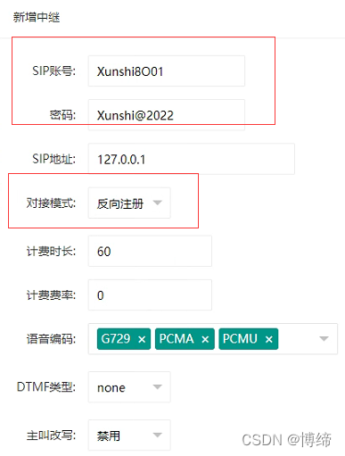
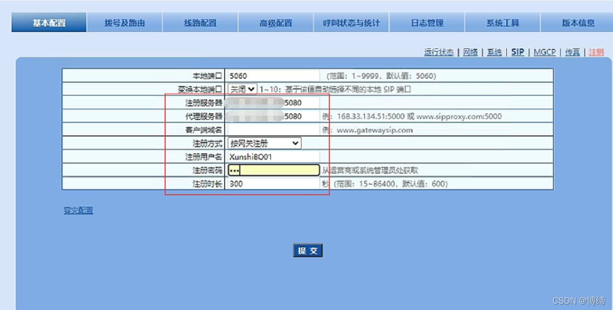
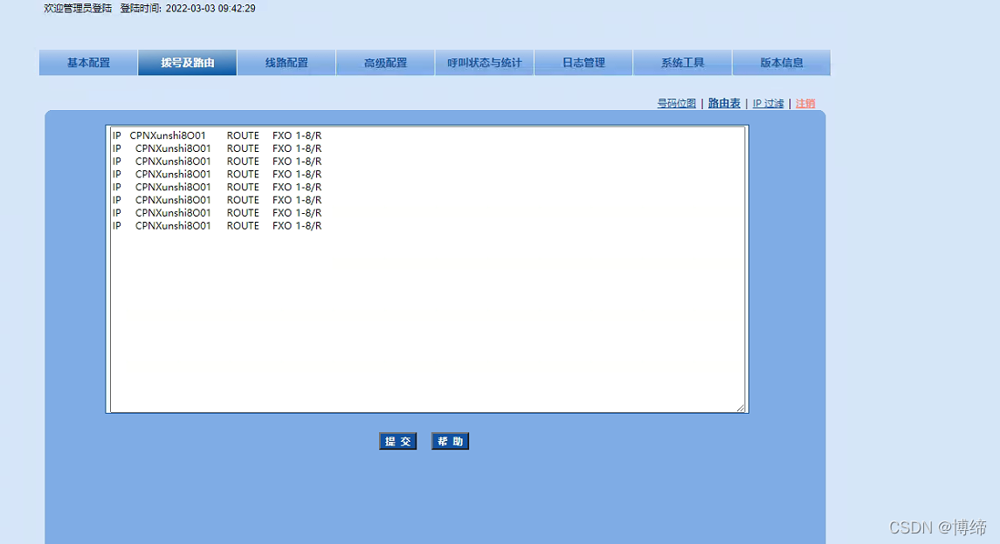

# 磐石云

## 磐石云添加O口网关

> 网关直接连接路由器，连接之前，先设置静态ip地址，然后就可以通过局域网进行配置了。

1. 先在系统里面添加一个中继，设置好账户密码，对接模式选反向注册

2. 然后去网关里面注册刚刚设置的账户密码，注册地址是 服务起的ip地址

IP   CPNXunshi8O01	ROUTE	FXO	1-8/R
IP  	CPNXunshi8O01	ROUTE	FXO	1-8/R
IP  	CPNXunshi8O01	ROUTE	FXO	1-8/R
IP  	CPNXunshi8O01	ROUTE	FXO	1-8/R
IP  	CPNXunshi8O01	ROUTE	FXO	1-8/R
IP  	CPNXunshi8O01	ROUTE	FXO	1-8/R
IP  	CPNXunshi8O01	ROUTE	FXO	1-8/R
IP  	CPNXunshi8O01	ROUTE	FXO	1-8/R