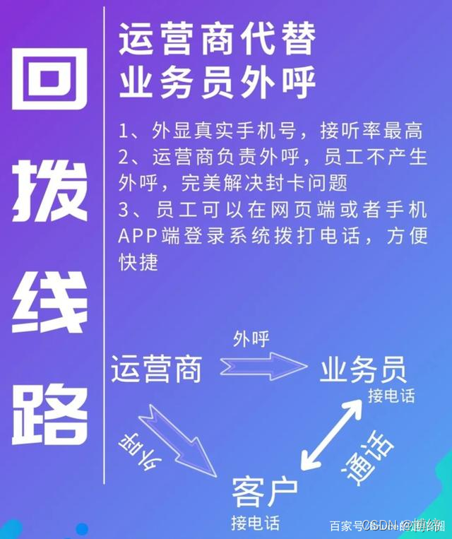

# 外呼成形的产品
[联奥电讯：专注呼叫中心系统，电话外呼系统，呼叫中心](http://www.chainall.com/index.html)

# 外呼行业认知
## 一、解析一下企业通信市场上的AXB模式
A代表员工号码，X代表转接中间号，B代表客户号码
呼叫流程是员工A在系统里点击拨号，系统会自动给X号码拨号，X号码自动接听，X号码再呼叫B号码。
然后B号码看到的来电是A的号码，不会看到X的号码。
这就是通常的AXB显A线路。

1、他没办法解决封卡封号问题。因为员工A卡是在不断呼出的，即使只是固定打给一个或者几个绑定的中间号X号，也同样是外呼，电话打的多了依然会被运营商检测到，进而封卡。
2、AXB是双向收费的，他会收取员工A呼叫中间号X的话费，还会收取X呼叫给B的费用，费用成本是很高的，如果客户B未接，依然收取第一个步骤的费用
3、这也是很多客户说的新回拨线路，但是实际上他不是回拨线路，回拨线路的流程是系统里点击拨号，这时候X号码自动拨打A号码，A号码接电话，然后X自动把电话转给B，然后B那边看到的号码是A的，B接听了就可以和A通话了。
其中A作为业务员，实际上他只是在接电话，不存在外呼，所以才能解决呼出过多被封卡的问题。而且回拨线路是单向收费的，只收取X呼叫B的话费。

所以模式从根本上就是不一致的。

## 二、根据目前形势分析网络电话

目前电销行业在政策管控下也是越来越严格，传统拉线布线的模式成本太高，现在也有封号情况发生，不再适用于电销，目前电销市场也只有两种模式，网络电话和回拨模式，下面主要讲下网络电话的状况。

网络电话VoIP是一种以IP电话为主，并推出相应的增值业务的技术，依托于互联网。

网络电话之前十分费用低廉，网络电话的费用前几年的时候低到2-5分钱/分钟，全国都一样资费。

目前管控之下大量线路被直接砍掉，留下来的也是相对来讲稳定的线路，资费也到了1毛-1毛5/分钟，和市场其他线路资费基本持平。

功能方面也能做到自动接听，一键呼出，批量呼出，录音，话务报表等基本也都是有的，主要看各公司技术做的附加功能。

拨打方式主要是电脑插耳机一键拨打，或者手机下载APP配置，手机拨打皆可。

显示号码都是通信公司提供或者帮忙申请号码，也是看各公司的资源情况，资源差一点的有随机显示全国号码，偶尔有国外号码。

资源好一点的会有显示固定地区固话号码或者固定手机号，或者显示固定地区随机固话或者随机手机号。

还有一种电话打到哪个地区就显示哪个地区的固话或者手机号，但这种基本已经绝迹了。

标记问题，众所周知，标记都是第三方软件进行的，像360、电话邦、华为、腾讯、小米等等，手机都有标记号码为骚扰电话，广告推销，诈骗电话的功能，一旦标记多了，会极其影响接通率，而且通信公司给你的号码是很难更换掉的，刚开始可能号码是全新的，接通率不错，越用接通率越低，越用越差，这个也是被用户诟病最多的地方。

虽然各个网络电话的通信公司都在吹自己线路稳定性，但网络电话还是需要依靠网络环境，如果网络环境不好，会出现串线，听不清乃至听不见客户声音的情况，在偏远一点的城市这边更是致命，这一点无论是网络电话还是QQ微信等所有通话软件都不能避免的。

软件方面也不会一直处于稳定，像通话延迟、语音数据包丢失等都会影响正常的通话体验，这个和通信公司有分不开的关系，偶尔运营商线路波动，可能对于企业就会有更大影响。　

最后就是目前的封号情况了，虽然这个号码是通信公司提供的，但客户投诉还是避免不了封号，而且和一般封卡不一样，这种网络电话如果被客户投诉，封的就是一整条线路，情况一般的话，就封一家公司的线路，情况严重点，整个通信公司的线路都会被停掉。

打出去是虚拟号的模式逐渐会走不通的，民法典也有相关条例，外呼必须是真实号码。

关于网络电话，就分享这么多，有问题可以私聊我咨询。

## 3、员工打电话过多，高频呼出被停机怎么解决？
目前电销行业在政策管控下也是越来越严格，传统拉线布线的模式成本太高，现在也有封号情况发生，不再适用于电销，目前电销市场也只有两种模式，网络电话和回拨模式，下面主要讲下网络电话的状况。

网络电话VoIP是一种以IP电话为主，并推出相应的增值业务的技术，依托于互联网。

网络电话之前十分费用低廉，网络电话的费用前几年的时候低到2-5分钱/分钟，全国都一样资费。

目前管控之下大量线路被直接砍掉，留下来的也是相对来讲稳定的线路，资费也到了1毛-1毛5/分钟，和市场其他线路资费基本持平。

功能方面也能做到自动接听，一键呼出，批量呼出，录音，话务报表等基本也都是有的，主要看各公司技术做的附加功能。

拨打方式主要是电脑插耳机一键拨打，或者手机下载APP配置，手机拨打皆可。

显示号码都是通信公司提供或者帮忙申请号码，也是看各公司的资源情况，资源差一点的有随机显示全国号码，偶尔有国外号码。

资源好一点的会有显示固定地区固话号码或者固定手机号，或者显示固定地区随机固话或者随机手机号。

还有一种电话打到哪个地区就显示哪个地区的固话或者手机号，但这种基本已经绝迹了。

标记问题，众所周知，标记都是第三方软件进行的，像360、电话邦、华为、腾讯、小米等等，手机都有标记号码为骚扰电话，广告推销，诈骗电话的功能，一旦标记多了，会极其影响接通率，而且通信公司给你的号码是很难更换掉的，刚开始可能号码是全新的，接通率不错，越用接通率越低，越用越差，这个也是被用户诟病最多的地方。

虽然各个网络电话的通信公司都在吹自己线路稳定性，但网络电话还是需要依靠网络环境，如果网络环境不好，会出现串线，听不清乃至听不见客户声音的情况，在偏远一点的城市这边更是致命，这一点无论是网络电话还是QQ微信等所有通话软件都不能避免的。

软件方面也不会一直处于稳定，像通话延迟、语音数据包丢失等都会影响正常的通话体验，这个和通信公司有分不开的关系，偶尔运营商线路波动，可能对于企业就会有更大影响。　

最后就是目前的封号情况了，虽然这个号码是通信公司提供的，但客户投诉还是避免不了封号，而且和一般封卡不一样，这种网络电话如果被客户投诉，封的就是一整条线路，情况一般的话，就封一家公司的线路，情况严重点，整个通信公司的线路都会被停掉。

打出去是虚拟号的模式逐渐会走不通的，民法典也有相关条例，外呼必须是真实号码。

关于网络电话，就分享这么多，有问题可以私聊我咨询。

## 4、电销卡是智商税吗？不喜勿喷
电销卡？你觉得是电销卡商家能干过国家工信部还是怎么？

电销卡随便打，包月打不封号，这智商税交的666666。

国家出台通信管控政策就是为了避免你手机卡呼出电话频繁骚扰。

挂着电销卡的名号打电话就不扣你卡的话费了？你手机就没有呼出记录了吗？

稍微打多一点，就能查到是有过多呼出记录和消费记录，一旦超标，立刻封号。

但中小型企业还是要靠电销做下去的，所以才会有通信公司的存在。

只给正规行业的企业提供呼叫系统和外呼线路，你个人想合作或者是敏感行业想合作？

不可能的！除非这家通信公司不想做了，所以现在通信公司最主要的还是合规，合规第一，客户第二！

至于真正的白名单电销卡也是有的，只不过办理非常繁琐，企业和个人都要提供一定的资质才能发放，不然类似外卖，快递等没办法开展业务，但如果这些卡借出去给其他行业来打电销，个人会上黑名单的。

敏感行业类似金融，催收，POS机，收藏品，保健品，奢侈品等，这些通信公司都不敢接的，因为如果出一起诈骗，整个公司线路全停不说，公司说不定还会受到牵连。

后面国家管控会越来越严格，通信方面的路合规了才能走的长远。

综合来说，一般企业还是不建议去办电销卡，电销卡根本解决不了你的问题。

推荐去找正规合规的通信公司会更好一些，给大家提个醒，通信公司跟软件公司不一样的。通信公司是主做通信线路的，系统一般都是附带。而软件公司都是接入的通信公司的通信线路，更侧重于推销自己的软件产品。

大家见仁见智，有问题可以私信我沟通。

## 5、如何避免高频封卡，解决电销难题。
打电话封卡一般有两种情况：

第一是客户恶意举报封卡，这种是任何方式外呼都无法解决的。

第二是电话高频呼出被运营商检测到，进而封卡。

目前打电话封卡的原因最主要是高频呼出，这个问题如何解决呢？

第一种方法就是办多张卡，插到网关上打电话，打比方你办10张卡，每张卡每天呼出20个电话，这样就不算高频了，有效降低封卡概率。

第二种解决方法是采用回拨线路，在系统绑定A的个人号码，由系统进行呼出，A先接听，然后等B接听，B看到的依然是A的手机号，这种模式A和B都是属于接电话，接电话没有通话记录和呼出记录，可以避免封卡封号。

第三种是采用通信公司的网络电话，号码由通信公司提供，打电话直接电脑插耳机呼出，打出去有显示随机手机号或者随机固话号码。

第四种就是外卖，快递，物流之类的，他们能办正经的白名单卡，比市场电销卡好很多，都实名认证加企业认证的，管控非常严格。

## 6、电销管控过后，个人手机卡不能再用作业务电销

对于中小型的销售企业来讲，电销虽然收到工信部管控，但还是成本最低，效率最高的一种成单方式，现在电销首先要考虑的有两块最重要的问题。

首先是电话卡被封，也是目前来讲最严重的一个问题，因为工信部的管控导致我们个人办的电话卡无法高频外呼，封多了还容易变成运营商的黑户，无法继续办卡，导致个人信用受损。其实这个问题也很好解决，只要是业务正规的企业外呼，我们都可以通过申请外呼专线的方式来打电话，工信部封双卡主要是为了从源头解决电信诈骗等案件，正常的电话营销或回访客户是被允许的。

其次就是客户的跟进，管理者可以通过培训自己的员工，让员工养成一个良好的跟进客户的方式，这点对于销售精英来讲不是难事，或者购买外呼系统，现在外呼系统可以帮助员工制定良好的跟进方式，解决意向客户跟进不出来的问题。

目前只有电销专线客户做到监管和稳定，当然审核就很严格了。而且上线之后每一通电话都会收到系统和人工的双重质检。像一些不正规的行业，运营商直接是不会给线路的，所以企业还是正规点才能用上好的线路吗，系统拔打电话，可以完美规避到封卡封号的风险，创造更大的价值。

## 7、目前市场最常见的几种通信线路
回拨线路：业务员把手机绑定到系统上，在系统上给客户拨打电话时，业务员会先接到来自运营商的中间固话，业务员接听后才会拨打给客户，这样坐席跟客户处于被叫状态，运营商承担主叫，营业厅查询不到业务员的呼出记录，这样就避免了高频呼出导致封卡封号，客户这边外显是业务员的手机号码，客户可以回拨给业务员。

虚拟线路：此方案适用于员工不想要办卡，这是拿公司的资质去运营商那边报备的同时申请一批全新的手机号码，外显是170.171开头的，归属地可以全国一到三线城市自由选择，不过因为外显是虚拟号，号码主要作用于外显，没有回拨功能。

AXB线路：A是业务员，X是中间号，B是客户，原理就是系统里点击拨号，手机端APP默认会自动给X号码拨号。 X号码自动接听。X号码再呼叫B号码。然后B号码看到的来电是A的号码，不会看到X的号码。这就是通常的AXB显A线路，这种方式会被某些公司宣传是回拨线路，实际上这不是线路。只是用到了透传的个人搭建的小系统。他没办法解决封卡封号问题。因为A卡是外呼。呼叫多了肯定会被封卡。AXB是双向收费的，他会收取A呼叫X的话费，还会收取X呼叫给B的费用。话费很贵。

混显线路：这线路是号码池的号码，基本上所有的公司都在使用这个号码池，每次呼出号码都是不可控的，外显是全国各地的号码。而且每个电话号码被标记问题可达几千条，所以接通率特别低。

95.96线路：这是早期做营销类的电话销售，外显是95.96的固话，由于现在的人都知道这些是营销类电话，所以基本上接通率很低，而且标记问题也是处理不了的。

## 8、外呼系统用什么线路最好？回拨线路好在哪儿？

外呼系统用什么线路最好？回拨线路好在哪里？

回拨模式解决封卡：通过系统绑定员工手机号码进行拨打的，在系统里鼠标点击进行一键拨打，系统会给你绑定的员工手机号打一个电话，员工手机接通以后才会打到客户那边，这样员工打一天电话就等于接了一天电话，员工的手机号也不会产生话费和通话记录，话费和呼出记录走的都是系统，运营商检测不到你手机的呼出记录，自然不会封号。

回拨模式对比其他线路的优势：

1、显示员工自己手机号，而且可以随时更换，灵活性高。

2、客户也可以直接回到员工手机号上，避免客户流失。

3、收费便宜，1毛钱1分钟打全国。

4、管控严格合规，专线专用，不接任何高风险行业，不会受到高风险行业的牵连。

5、依靠通讯设备本身的信号通话，通话质量良好，不会串线，断线。

6、完全规避高频打电话产生的封号封卡问题。

以上就是对回拨线路的解读

商家提供的免费服务

一、软件服务

1、软件免费提供，包括PC网页端与手机APP版本。

2、软件功能包括：组织架构，权限管理，用户管理，网站获客，社交获客，客户导入，客户分配，客户分类，客户跟进，客户管理，公司客户池，跟单协作，销售机会，合同，订单，回款，以及各种客户报表，跟单报表等等。

3、通信功能：号码一键拨打，坐席管理，通话记录，录音，话务报表，通话排名，日消费记录等等。

二、通信服务

1、拨打模式：企业自办“移动最低月租卡”与后台绑定,电脑点击拨打-手机接听,客户处显示即绑定的手机号。

2、核心线路: PSTN运营商核心线路, 通话稳定, 外显手机号接通率高,可回拨, 防封号性能强。

3、号码盾：判断高危号码，减少号码标记，防骚扰控投诉，减少外呼风险。

三、售后服务

1、提供7*24小时的售后服务

2、一对一服务,采用微信群对接方式,快速响应,周六日均有值班客服

可接入行业：教育、财税、知识产权、装修、电商、法律，网络推广、招商加盟、展会、软件开发、人力资源、产品零售等正规行业。

## 9、选择外呼系统，怎么保障稳定性和接通率？

选择外呼系统最重要的俩点，第一稳定性，第二接通率。
线路的稳定性影响着公司的稳定和成本，接通率影响着公司的客户转化率和业绩

稳定性怎么解决？

第一就是看通信公司的实力和规模，小公司不用考虑，因为小公司一般没有自己的通信线路，都是接的一些市场上的野鸡线路，或者二手线路。有规模的公司是直接对接三大运营商的线路，或者跟运营商共同投资的线路，也有话语权，更能保证线路的稳定且多样性。

第二是要保证这个线路风控是很严格的，最好是行业专线，因为这样不会受到其他行业的牵连，因为有些小公司为了产品的竞争力，故意把价格定的很低，但是成本就在那，怎么控制呢，那就是不同行业（包括敏感行业）共用一条线路，这样的话成本就直线下降，但是这样又造成一个因素，那就是假如其中有一家公司违规操作或者被客户实名投诉后，那么使用这个线路的许多家公司都会面临下线，所以选择的时候不要去贪小便宜，尽量高点预算，选择大公司去合作，提供稳定的线路保障。