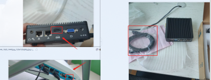
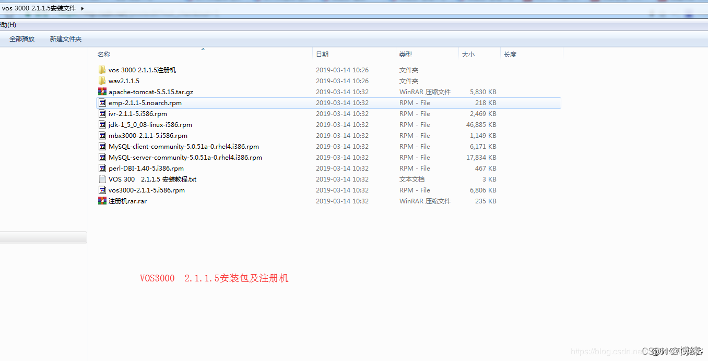

# VOS6.0安装并对接okcc(最新)

> 本方案基于2021.08.18探索的安装方式。


### 1\. 硬件环境条件

#### 1-1\. 移动线路：两个LAN口网卡，一个wifi。
LAN网口：接入公网ip、接入ims内网线路无线wifi网卡：用来连接互联网，向日葵远程管理用。Linux版本：Centos6.1 VOS6
#### 1-2\. 联通线路：三个网卡外加O口转换设备

LAN网口：接入公网ip、接入O口转换设备无线wifi网卡：用来连接互联网，向日葵远程管理用。O口转化设备：将Rj11电话口，转化成sip线路，然后去对接VOSO口网关的配置：实现录音中通话和振铃分离的效果

1.  一定要开通反极信号信号，这样可以识别到对方挂断电话的方式。
2.  将每条线路都开通 检测反极信号。
3.  在设置，高级网关中开通 检测反极信号
4.  将来显和振铃检测模式改为 振铃后B


### 2\. 软件条件
#### 2-1\. 宿主机系统
##### 2-1-1\. 寄居虚拟化：Win10或者WinServer2019
> 理论上这个宿主系统是不受限制的，只要是能安装VMware，都是可以的。

###### 2-1-1-1\. 主机系统：
1.  Win10 （可以正常使用）
2.  WinServer2019 （可以正常使用）
###### 2-1-1-2\. 系统软件：
1.  VMware16 （安装VOS系统）
2.  向日葵（远程控制）
3.  360极速浏览器（下载镜像）
##### 2-1-2\. 裸金属虚拟化 (探索中，不可以使用)
###### 2-1-2-1\. Esxi
###### 2-1-2-2\. PVE
###### 2-1-2-3\. Hyper-V
#### 2-2\. 安装VOS6.0
##### 2-2-1\. Centos镜像下载
使用Centos6.1迷你版本的镜像 [Centos6.1迷你版本](http://mirror.nsc.liu.se/centos-store/6.1/isos/x86_64/)网址大概如下：<http://120.221.34.87:6510/mirror.nsc.liu.se/centos-store/6.1/isos/x86_64/CentOS-6.1-x86_64-minimal.iso>

##### 2-2-2\. VMware 安装虚拟机：一定要两个网卡一起安装。然后多重启几次。
虚拟机的配置：4核心4G内存，双网卡桥接添加双网卡，双网卡桥接到虚拟机配置网络（配置IP地址）：
1.  网络网卡：配置完整加DNS，达到可以上网的状态
2.  IMS线路网卡：只配置IP地址和子网掩码PREFIX，不配置网关
##### 2-2-3\. 安装VOS
###### 2-2-3-1\. 配置Yum源头

1.  一个是1500提供的yum源
2.  一个是阿里云提供的Centos6的yum源

上传完，只需要看看yum list 有没有显示就好了。

###### 2-2-3-2\. 安装VOS

1.  上传VOS镜像到root目录下
2.  执行install脚本，第一次是降核，然后重启，在执行一次intall,安装vos，等待安装成功。
3.  保存安装完成后的uuid。
4.  复制激活字符串


vos的默认密码admin  admin


激活的时候，生成 了激活码，一定要改名为license.dat

这里也无需配置路由，任何路由都不需要配置。在注册IMS的时候选择我们内网网卡即可。
如果连接不上，请直接添加这个路由如果无法注册，单独添加个路由。


==（2021.10.04添加张店vos使用）route add -net 218.201.120.0 netmask 255.255.255.0 gw 172.17.156.65 #9C27B0==
==（2021.11.15添加永久路由，重启，不失效）在 vi /etc/rc.local 。。。。route add -net 218.201.120.0 netmask 255.255.255.0 gw 172.17.156.65 #9C27B0==

然后远程进入Centos6.1系统的主机安装VOS，记录生成UID信息之后进行授权。
#### 2-3\. 对接到OKCC
1.  注册ims线路，然后添加落地，注册的时候指定内网网卡即可。
2.  添加外呼费率问题，从0-9一次添加好
3.  添加对接网关：天天外呼系统的ip地址
4.  添加SIP话机：用于OKCC的注册对接
5.  OKCC中添加中继，添加路由，在路由中，填入信息，然后可以控制时间段。

>  ims内网网卡：联接ims，负责线路。直连移动ims终端

DEVICE="eth2"ONBOOT="yes"BOOTPROTO=staticIPADDR=172.17.156.82PREFIX=27

>  外网网卡：配置互联网，将ims分出sip线路，共享到阿里云。

DEVICE=eth0HWADDR=00:0C:29:0F:04:BCTYPE=EthernetUUID=b8630bca-313c-4159-9482-70e7f3e4bafeONBOOT=yesNM_CONTROLLED=yesBOOTPROTO=staticIPADDR=192.168.101.233NETMASK=255.255.255.0NETWORK=192.168.101.0GATEWAY=192.168.101.1DNS1=114.114.114.114DNS2=1.2.4.8

#### 2-4\. 虚拟机安装Centos6.5的操作系统

1. 上传一件安装脚本到系统的/home路径下2. 配置系统的yum源，附件如下：[extras]gpgcheck=1gpgkey=http://113.125.102.158:8989/centos6/RPM-GPG-KEY-CentOS-6enabled=1baseurl=http://113.125.102.158:8989/centos6/extras/name=Qcloud centos extras - $basearch[os]gpgcheck=1gpgkey=http://113.125.102.158:8989/centos6/RPM-GPG-KEY-CentOS-6enabled=1baseurl=http://113.125.102.158:8989/centos6/os/name=Qcloud centos os - $basearch[updates]gpgcheck=1gpgkey=http://113.125.102.158:8989/centos6/RPM-GPG-KEY-CentOS-6enabled=1baseurl=http://113.125.102.158:8989/centos6/updates/name=Qcloud centos updates - $basearch


## 疑难解惑
1. 如果可以使用，没有声音，那么重新进行破解，然后注册一下。


CentOS 6.9-610  x64位

命令补全Tab

xshell粘贴命令 shift + ins

上传vos30002173.tar.gz 到root目录下
tar zxvf vos30002173.tar.gz
cd vos30002173
ll 全绿运行 ./yumupdate.sh (更换yum源  CentOS7系列可能不需要)
执行./install 会降内核到2.6.32-696
执行后会重新启动  稍等会重新连接 
连接后执行 uname -a 查看内核
cd vos30002173
./install
安装后出现红字ip mac地址 全部复制 格式：
172.28.157.64,121.40.48.13 00:16:3F:00:56:FD 8086711380867020 1627749814
UUID为客户端登录界面系统标识符
02fa8f7d-6036-4650-998d-948cf19fb7d1

打开注册机 替换红字部分保存 运行  
运行后会生成ip_license.dat文件  更改名字为license.dat上传到服务器 /home/kunshi/license 
重启服务器reboot

VOS登录后阿里云服务器需要设置一下DMZ
业务管理-软交换管理-补充设置下点编辑复制下备注栏的信息-系统参数 DMZ设置 然后点应用

vos防护安装：
上传vossafe-centos6.bin到root目录 
执行chmod 777 *
ll 显示文件名绿色后继续执行
./vossafe-centos6.bin

 Safe-port: 5101  防护端口
  Web-port: 9090 查费地址
Phone-port: 9091 
  Sip-port: 62019,62029,62039 sip端口

防护注册复制机器码到tykj88.cn/vos.php生成注册码后 转回防护验证页面 填写license 保存 重启服务器


http://121.40.48.13:5101/protective.php


> 本套方案采用ims端做一台服务器，然后映射到一台公网服务器，然后我们可以直接使用公网服务器。


## 安装远程向日葵

连接显示器，开机，使用WLAN上网，安装向日葵
术语：
	找台正在用的主机，然后将后面的VGA线拔下来，插到小主机上。
[向日葵下载地址](https://sunlogin.oray.com/download/)





## 安装VOS

[VOS使用的Centos6.1迷你版](http://mirror.nsc.liu.se/centos-store/6.1/isos/x86_64/CentOS-6.1-x86_64-minimal.iso)

## 附件


## 待解决的问题？

1. 【已解决】只能拨打一分钟？==> 虚拟机未开通公网ip，无法将流量转发到阿里云。
2. 【已解决】双方没有声音，okcc本地录音可以。  ==》 原因如同第一个问题。
3. 【已解决】拨打电话经常会出现403的问题，有可能是拨打太频繁导致的。  ==》被ims运营商给限制了。关闭极护PPX就可以。目前还在寻找解决方案。一定要将部署上的ims线路进行落地。


## 思路：

在ims本地端安装一台vos，本地电脑需要开通公网ip地址。
在阿里云服务器安装一台云端服务器
将本地与云端服务器，进行对接。

采用OpenWrt中转的方式。lede 中安装 dmz插件，转发到vos虚拟机中，然后对接到okcc，对接方式：采用对等模式。先创建落地网关对接落地，再对接网关对接来自呼叫中心的呼入。

## 安装流程：

准备好VOS3000 V2.1.6.0的安装包

### 一、优先安装ims端vos：

#### 1.重点硬件：双网卡

配置路由！

配置永久路由：

```Shell
#  在/etc/rc.local里添加
route add -net 218.201.120.0 netmask 255.255.255.0 gw 172.17.145.129
route add -net 172.17.145.128 netmask 255.255.255.224 gw 172.17.145.129

```

```Shell
centos下双网卡双线双IP的配置方法(转)

Linux双网卡双线双IP。
【方法1】
例如：
固定电信和网通IP地址/掩码/网关到网卡:eth0和eth1
eth0配置文件固定：60.29.231.160 255.255.255.192 60.29.231.1（网通IP）
eth1配置文件固定：114.80.66.145 255.255.255.192 114.80.66.1（电信IP）
#vi /etc/iproute2/rt_tables（增加电信和网通两个路由表）
252  tel （电信）
251  cnc （网通）
 
复制代码 代码示例:
#vi /etc/rc.d/rc.local（设置电信和网通路由表内容）
ip route replace default via 114.80.66.1 dev eth1（默认路由线路）
ip route flush table tel  （刷新tel路由表）
ip route add default via 114.80.66.1 dev eth1 src 114.80.66.145 table tel（添加回环地址）
ip rule add from 114.80.66.145 table tel（从114.80.66.145过来的，走tel路由）
ip route flush table cnc
ip route add default via 60.29.231.1 dev eth0 src 60.29.231.160 table cnc
ip rule add from 60.29.231.160 table cnc 保存退出
#reboot（重启）


【方法2】 
例如：
固定电信和网通IP地址/掩码/网关到网卡:eth0和eth1
eth0配置文件固定：60.29.231.160 255.255.255.192 60.29.231.1（网通IP）
eth1配置文件固定：114.80.66.145 255.255.255.192 114.80.66.1（电信IP）

eth1:（电信）
114.80.66.145(IP地址)
255.255.255.192(掩码)
114.80.66.1(网关)

eth0: （网通）
60.29.231.160(IP地址)
255.255.255.192(掩码)
注意：此处不要再设置网通的gateway(网关)

# vi /etc/iproute2/rt_tables
251 cnc (251可以是1-254之间任意，但不能与路由表已有的一样)
 
复制代码 代码示例:
# vi /etc/rc.local
ip route add default via 60.29.231.1 dev eth0 src 60.29.231.160  table cnc
ip rule add from 60.29.231.160 lookup cnc
ip rule add to 60.29.231.160 lookup cnc
# reboot

说明：
因为就2个线路，此方法和上面的方法区别：
电信做主路由，只需新建一个cnc的路由表即可。
推荐使用方法2。
```


```Shell
# 实现这个状态
172.17.145.128/27 dev eth1  proto kernel  scope link  src 172.17.145.132 
192.168.101.0/24 dev eth0  proto kernel  scope link  src 192.168.101.233 
169.254.0.0/16 dev eth0  scope link  metric 1002 
169.254.0.0/16 dev eth1  scope link  metric 1003 
default via 192.168.101.1 dev eth0 
```


> ims内网网卡：联接ims，负责线路。直连移动ims终端

```Shell
DEVICE=eth1
HWADDR=00:0C:29:0F:04:C6
TYPE=Ethernet
UUID=4129e275-24d6-4b50-811c-b7b0d2ed01b0
ONBOOT=yes
NM_CONTROLLED=yes
BOOTPROTO=static
IPADDR=172.17.145.132
NETMASK=255.255.255.224
NETWORK=172.17.145.128
GATWAY=172.17.145.129
```


> 外网网卡：配置互联网，将ims分出sip线路，共享到阿里云。

```Shell
DEVICE=eth0
HWADDR=00:0C:29:0F:04:BC
TYPE=Ethernet
UUID=b8630bca-313c-4159-9482-70e7f3e4bafe
ONBOOT=yes
NM_CONTROLLED=yes
BOOTPROTO=static
IPADDR=192.168.101.233
NETMASK=255.255.255.0
NETWORK=192.168.101.0
GATEWAY=192.168.101.1
DNS1=114.114.114.114
DNS2=1.2.4.8

```

#### 2.虚拟机安装Centos6.5的操作系统

1. 上传一件安装脚本到系统的/home路径下
2. 配置系统的yum源，附件如下：

```Shell
[extras]
gpgcheck=1
gpgkey=http://113.125.102.158:8989/centos6/RPM-GPG-KEY-CentOS-6
enabled=1
baseurl=http://113.125.102.158:8989/centos6/extras/
name=Qcloud centos extras - $basearch
[os]
gpgcheck=1
gpgkey=http://113.125.102.158:8989/centos6/RPM-GPG-KEY-CentOS-6
enabled=1
baseurl=http://113.125.102.158:8989/centos6/os/
name=Qcloud centos os - $basearch
[updates]
gpgcheck=1
gpgkey=http://113.125.102.158:8989/centos6/RPM-GPG-KEY-CentOS-6
enabled=1
baseurl=http://113.125.102.158:8989/centos6/updates/
name=Qcloud centos updates - $basearch
```

#### 3. 系统降核：

#### 4. VOS系统激活

购买正版激活码，然后对其进行激活。

### 二、安装阿里云vos：


关于探索历史：
从github上找vos的源码


> 本套方案采用ims端做一台服务器，然后映射到一台公网服务器，然后我们可以直接使用公网服务器。

## 思路：

在ims本地端安装一台vos，本地电脑需要开通公网ip地址。
在阿里云服务器安装一台云端服务器
将本地与云端服务器，进行对接。

## 安装流程：

准备好VOS3000 V2.1.6.0的安装包

### 一、优先安装ims端vos：

#### 1.重点硬件：双网卡

配置路由！

配置永久路由：

```Shell
#  在/etc/rc.local里添加
route add -net 218.201.120.0 netmask 255.255.255.0 gw 172.17.145.129
```

```Shell
# 实现这个状态
172.17.145.128/27 dev eth1  proto kernel  scope link  src 172.17.145.132 
192.168.101.0/24 dev eth0  proto kernel  scope link  src 192.168.101.233 
169.254.0.0/16 dev eth0  scope link  metric 1002 
169.254.0.0/16 dev eth1  scope link  metric 1003 
default via 192.168.101.1 dev eth0 
```


> ims内网网卡：联接ims，负责线路。直连移动ims终端

```Shell
DEVICE=eth1
HWADDR=00:0C:29:0F:04:C6
TYPE=Ethernet
UUID=4129e275-24d6-4b50-811c-b7b0d2ed01b0
ONBOOT=yes
NM_CONTROLLED=yes
BOOTPROTO=static
IPADDR=172.17.145.132
NETMASK=255.255.255.224
NETWORK=172.17.145.128
GATWAY=172.17.145.129
```


> 外网网卡：配置互联网，将ims分出sip线路，共享到阿里云。

```Shell
DEVICE=eth0
HWADDR=00:0C:29:0F:04:BC
TYPE=Ethernet
UUID=b8630bca-313c-4159-9482-70e7f3e4bafe
ONBOOT=yes
NM_CONTROLLED=yes
BOOTPROTO=static
IPADDR=192.168.101.233
NETMASK=255.255.255.0
NETWORK=192.168.101.0
GATEWAY=192.168.101.1
DNS1=114.114.114.114
DNS2=1.2.4.8

```

#### 2.虚拟机安装Centos6.5的操作系统

1. 上传一件安装脚本到系统的/home路径下
2. 配置系统的yum源，附件如下：

```Shell
[extras]
gpgcheck=1
gpgkey=http://113.125.102.158:8989/centos6/RPM-GPG-KEY-CentOS-6
enabled=1
baseurl=http://113.125.102.158:8989/centos6/extras/
name=Qcloud centos extras - $basearch
[os]
gpgcheck=1
gpgkey=http://113.125.102.158:8989/centos6/RPM-GPG-KEY-CentOS-6
enabled=1
baseurl=http://113.125.102.158:8989/centos6/os/
name=Qcloud centos os - $basearch
[updates]
gpgcheck=1
gpgkey=http://113.125.102.158:8989/centos6/RPM-GPG-KEY-CentOS-6
enabled=1
baseurl=http://113.125.102.158:8989/centos6/updates/
name=Qcloud centos updates - $basearch
```

#### 3. 系统降核：

#### 4. VOS系统激活

购买正版激活码，然后对其进行激活。

### 二、安装阿里云vos：


关于探索历史：
从github上找vos的源码

待解决的问题？

1. 只能拨打一分钟？
2. 双方没有声音，okcc本地录音可以。
3. 拨打电话经常会出现403的问题，有可能是拨打太频繁导致的。


### 1.VOS虚拟机系统使用


- 配置ims线路账户
- 将ims线路进行落地操作。
- 配置阿里云ims线路，不需要进行落地
- 配置话机用于测试。


### 2.VOS阿里云系统使用

- 阿里云在线对接ims端虚拟机
- 配置话机线路，用以对接天天外呼


### 3.天天外呼对接VOS系统

- 配置天天外呼，外呼系统。
- MicroSip电话的配置
- 或者 eyeBeam 软电话的配置


#### 1.新添加号码

导入Excel账户，应用，修改落地通话限制，修改菜单里的，转发从自动改为确定。


#### 2.新添加SIP账户

出现问题，就直接添加新企业账户。


### 4.vos数据操作

```Shell
# 虚拟机本地主机
GRANT ALL PRIVILEGES ON *.* TO 'root'@'192.168.101.%' IDENTIFIED BY '' WITH GRANT OPTION;
flush privileges;

REVOKE ALL PRIVILEGES ON *.*  'root'@'192.168.101.%';
flush privileges;


# 远程本地远程
GRANT ALL PRIVILEGES ON *.* TO 'root'@'112.240.14.183' IDENTIFIED BY '' WITH GRANT OPTION;
flush privileges;

REVOKE ALL ON *.*  'root'@'112.240.14.183';
flush privileges;

```


## 问题解决方案？

如果出现 服务器未注册的情况？


解决电话封号问题，

1. 现有外显本机号码，
   2.专业回呼系统+直呼系统
   3.接所有的行业
   4.解决封卡封号问题，
   5.线路稳定，欢迎咨询
   6.不限数量
   电话13849641417微信同步
   欢迎咨询


## 本地电话呼叫转移

### 呼叫转移设置方法如下：

1. 拨打*41*DN#设置无应答转移，拨打#41#取消无应答转移。
2. 拨打*40*DN#设置遇忙转移，拨打#40#取消遇忙转移。
3. 拨打*57*DN#设置无条件转移，拨打#57#取消无条件转移。

### 温馨提醒：	

1. DN表示需转移的号码。
2. 呼叫转移产生的通话费按固话正常通话费缴纳，若办理的套餐有分钟数，呼叫转移所产生的分钟数按正常计费规则进行抵扣。

## 本地线路上云方案

### 方案一:运营商为模拟线路

线路要求:运营商根据客户需求通过小交连选等方式实现多条模拟线对应同一个联通接入号，实现多人同时拨打该号码能依次给多条电话线振铃。
设备要求:用户侧提供O口模拟网关与联通模拟线对接，且模拟网关接入任何能访问云主机的互联网网线。

### 方案二:联通提供公网上的SIP线路，比如联通BPO业务

线路要求:
1 联通将用户指定固话号做到联通BPO平台
2 联通BPO平台提供公网注册地址，用户名及密码。
设备要求: 无需其他设备，云主机直接向联通sip注册。

### 方案三:联通提供内网上的SIP线路，类似于移动IMS业务。

设备要求:
1 用户侧提供一台双网卡物理服务器或台式机，操作系统为windows7及以上或centos6.5及以上。
2 物理服务器或台式机一个网卡接能放问云主机的互联网网线。
3 物理服务器或云主机另一个网卡接联通内网(语音专线)网线。
线路要求:
1 联通提供可供号码注册的内网(或语音专线)，提供终端设备(服务器或台式机)使用的ip地址
2 联通提供内网注册地址，用户名及密码。


## 电话线无法通过O口网关连接到话务系统服务器？

答：O口网关跟话务系统服务器要选择相同的加密方式。

打不出电话去？

答：用SIP软电话检查O口网关是否注册好，没有注册好的好，先配置好O口网关，如果注册好的话，检查S口网关能不能收到电话信号，收不到检查S口网关是否注册到话务系统服务器，确保S端口对应的sip注册成功，然后检查是否能通话。

接电话62秒之后自动挂断？

答：在一分钟的时候，语音网关话务系统服务器发来的挂断的语音包，修改话务系统服务器设置。

接电话正常通话40秒、十分钟之后没有声音，但电话没有挂断？

原因：一段时间之后 s口网关收不到服务器发来的rtp数据包；接受语音的网络端口号，会发生改变，目前还是不知道什么原因造成的。


# vos3000 VOS3000端口介绍及安全防护

如何把 web端口改为8080之外的端口 

vos3000 ，如何修改web端口

vi /home/kunshiweb/base/apache-tomcat-7.0.23/conf/server.xml


找到这里的8080，把它改为1024以上端口 （web端口由kunshiweb用户启动，故无法使用1024以下端口，若确需修改，可联系技术人员）

/etc/init.d/vos3000webct restart （V2.1.4.0执行该命令）
/etc/init.d/webserverd restart （V2.1.6.00执行该命令）


tcp 端口：
vos登录: 1202
web： 8080 52088 61888 88
ssh:22
数据库：3306 3389
H323： 443 1719 1720 3719 3720
H245： 10000-49999
UDP端口:
数据库：3306 3389
ssh:22
SIP： 5060 5070 2028 2038(RC4)

RTP: 10000-49999