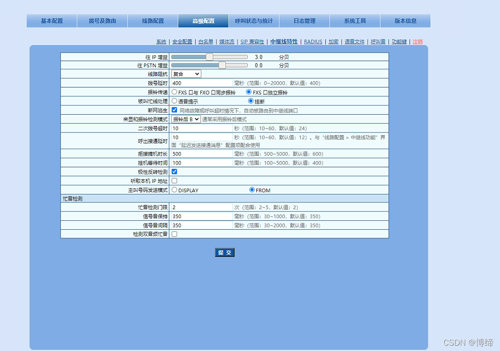
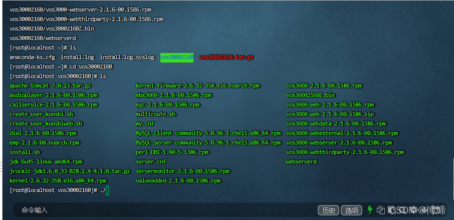

# VOS6.0安装并对接okcc(最新)

> 本方案基于2021.08.18探索的安装方式。

### 1\. 硬件环境条件

#### 1-1\. 移动线路：两个LAN口网卡，一个wifi。
LAN网口：接入公网ip、接入ims内网线路无线wifi网卡：用来连接互联网，向日葵远程管理用。Linux版本：Centos6.1 VOS6
#### 1-2\. 联通线路：三个网卡外加O口转换设备

LAN网口：接入公网ip、接入O口转换设备无线wifi网卡：用来连接互联网，向日葵远程管理用。O口转化设备：将Rj11电话口，转化成sip线路，然后去对接VOSO口网关的配置：实现录音中通话和振铃分离的效果

1.  一定要开通反极信号信号，这样可以识别到对方挂断电话的方式。
2.  将每条线路都开通 检测反极信号。
3.  在设置，高级网关中开通 检测反极信号
4.  将来显和振铃检测模式改为 振铃后B

### 2\. 软件条件
#### 2-1\. 宿主机系统
##### 2-1-1\. 寄居虚拟化：Win10或者WinServer2019
> 理论上这个宿主系统是不受限制的，只要是能安装VMware，都是可以的。

###### 2-1-1-1\. 主机系统：
1.  Win10 （可以正常使用）
2.  WinServer2019 （可以正常使用）
###### 2-1-1-2\. 系统软件：
1.  VMware16 （安装VOS系统）
2.  向日葵（远程控制）
3.  360极速浏览器（下载镜像）
##### 2-1-2\. 裸金属虚拟化 (探索中，不可以使用)
###### 2-1-2-1\. Esxi
###### 2-1-2-2\. PVE
###### 2-1-2-3\. Hyper-V
#### 2-2\. 安装VOS6.0
##### 2-2-1\. Centos镜像下载
使用Centos6.1迷你版本的镜像 [Centos6.1迷你版本](http://mirror.nsc.liu.se/centos-store/6.1/isos/x86_64/)网址大概如下：<http://120.221.34.87:6510/mirror.nsc.liu.se/centos-store/6.1/isos/x86_64/CentOS-6.1-x86_64-minimal.iso>

##### 2-2-2\. VMware 安装虚拟机：一定要两个网卡一起安装。然后多重启几次。
虚拟机的配置：4核心4G内存，双网卡桥接添加双网卡，双网卡桥接到虚拟机配置网络（配置IP地址）：
1.  网络网卡：配置完整加DNS，达到可以上网的状态
2.  IMS线路网卡：只配置IP地址和子网掩码PREFIX，不配置网关
##### 2-2-3\. 安装VOS
###### 2-2-3-1\. 配置Yum源头

1.  一个是1500提供的yum源
2.  一个是阿里云提供的Centos6的yum源

上传完，只需要看看yum list 有没有显示就好了。

###### 2-2-3-2\. 安装VOS

1.  上传VOS镜像到root目录下
2.  执行install脚本，第一次是降核，然后重启，在执行一次intall,安装vos，等待安装成功。
3.  保存安装完成后的uuid。
4.  复制激活字符串

vos的默认密码admin  admin

激活的时候，生成 了激活码，一定要改名为license.dat

这里也无需配置路由，任何路由都不需要配置。在注册IMS的时候选择我们内网网卡即可。
如果连接不上，请直接添加这个路由如果无法注册，单独添加个路由。

==（2021.10.04添加张店vos使用）route add -net 218.201.120.0 netmask 255.255.255.0 gw 172.17.156.65 #9C27B0==
==（2021.11.15添加永久路由，重启，不失效）在 vi /etc/rc.local 。。。。route add -net 218.201.120.0 netmask 255.255.255.0 gw 172.17.156.65 #9C27B0==

然后远程进入Centos6.1系统的主机安装VOS，记录生成UID信息之后进行授权。
#### 2-3\. 对接到OKCC
1.  注册ims线路，然后添加落地，注册的时候指定内网网卡即可。
2.  添加外呼费率问题，从0-9一次添加好
3.  添加对接网关：天天外呼系统的ip地址
4.  添加SIP话机：用于OKCC的注册对接
5.  OKCC中添加中继，添加路由，在路由中，填入信息，然后可以控制时间段。

>  ims内网网卡：联接ims，负责线路。直连移动ims终端

DEVICE="eth2"ONBOOT="yes"BOOTPROTO=staticIPADDR=172.17.156.82PREFIX=27

>  外网网卡：配置互联网，将ims分出sip线路，共享到阿里云。

DEVICE=eth0HWADDR=00:0C:29:0F:04:BCTYPE=EthernetUUID=b8630bca-313c-4159-9482-70e7f3e4bafeONBOOT=yesNM_CONTROLLED=yesBOOTPROTO=staticIPADDR=192.168.101.233NETMASK=255.255.255.0NETWORK=192.168.101.0GATEWAY=192.168.101.1DNS1=114.114.114.114DNS2=1.2.4.8

#### 2-4\. 虚拟机安装Centos6.5的操作系统

1. 上传一件安装脚本到系统的/home路径下2. 配置系统的yum源，附件如下：[extras]gpgcheck=1gpgkey=http://113.125.102.158:8989/centos6/RPM-GPG-KEY-CentOS-6enabled=1baseurl=http://113.125.102.158:8989/centos6/extras/name=Qcloud centos extras - $basearch[os]gpgcheck=1gpgkey=http://113.125.102.158:8989/centos6/RPM-GPG-KEY-CentOS-6enabled=1baseurl=http://113.125.102.158:8989/centos6/os/name=Qcloud centos os - $basearch[updates]gpgcheck=1gpgkey=http://113.125.102.158:8989/centos6/RPM-GPG-KEY-CentOS-6enabled=1baseurl=http://113.125.102.158:8989/centos6/updates/name=Qcloud centos updates - $basearch

## 疑难解惑
1. 如果可以使用，没有声音，那么重新进行破解，然后注册一下。

CentOS 6.9-610  x64位

命令补全Tab

xshell粘贴命令 shift + ins

上传vos30002173.tar.gz 到root目录下
tar zxvf vos30002173.tar.gz
cd vos30002173
ll 全绿运行 ./yumupdate.sh (更换yum源  CentOS7系列可能不需要)
执行./install 会降内核到2.6.32-696
执行后会重新启动  稍等会重新连接 
连接后执行 uname -a 查看内核
cd vos30002173
./install
安装后出现红字ip mac地址 全部复制 格式：
172.28.157.64,121.40.48.13 00:16:3F:00:56:FD 8086711380867020 1627749814
UUID为客户端登录界面系统标识符
02fa8f7d-6036-4650-998d-948cf19fb7d1

打开注册机 替换红字部分保存 运行  
运行后会生成ip_license.dat文件  更改名字为license.dat上传到服务器 /home/kunshi/license 
重启服务器reboot

VOS登录后阿里云服务器需要设置一下DMZ
业务管理-软交换管理-补充设置下点编辑复制下备注栏的信息-系统参数 DMZ设置 然后点应用

vos防护安装：
上传vossafe-centos6.bin到root目录 
执行chmod 777 *
ll 显示文件名绿色后继续执行
./vossafe-centos6.bin

 Safe-port: 5101  防护端口
  Web-port: 9090 查费地址
Phone-port: 9091 
  Sip-port: 62019,62029,62039 sip端口

防护注册复制机器码到tykj88.cn/vos.php生成注册码后 转回防护验证页面 填写license 保存 重启服务器

http://121.40.48.13:5101/protective.php