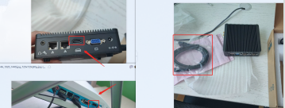

> 本套方案采用ims端做一台服务器，然后映射到一台公网服务器，然后我们可以直接使用公网服务器。


## 安装远程向日葵
连接显示器，开机，使用WLAN上网，安装向日葵
术语：
	找台正在用的主机，然后将后面的VGA线拔下来，插到小主机上。
[向日葵下载地址](https://sunlogin.oray.com/download/)





## 安装VOS
[VOS使用的Centos6.1迷你版](http://mirror.nsc.liu.se/centos-store/6.1/isos/x86_64/CentOS-6.1-x86_64-minimal.iso)

## 附件


## 待解决的问题？

1. 【已解决】只能拨打一分钟？==> 虚拟机未开通公网ip，无法将流量转发到阿里云。
2. 【已解决】双方没有声音，okcc本地录音可以。  ==》 原因如同第一个问题。
3. 【已解决】拨打电话经常会出现403的问题，有可能是拨打太频繁导致的。  ==》被ims运营商给限制了。关闭极护PPX就可以。目前还在寻找解决方案。一定要将部署上的ims线路进行落地。


## 思路：
在ims本地端安装一台vos，本地电脑需要开通公网ip地址。
在阿里云服务器安装一台云端服务器
将本地与云端服务器，进行对接。

采用OpenWrt中转的方式。lede 中安装 dmz插件，转发到vos虚拟机中，然后对接到okcc，对接方式：采用对等模式。先创建落地网关对接落地，再对接网关对接来自呼叫中心的呼入。

## 安装流程：
准备好VOS3000 V2.1.6.0的安装包

### 一、优先安装ims端vos：

#### 1.重点硬件：双网卡

配置路由！

配置永久路由：

```Shell
#  在/etc/rc.local里添加
route add -net 218.201.120.0 netmask 255.255.255.0 gw 172.17.145.129
route add -net 172.17.145.128 netmask 255.255.255.224 gw 172.17.145.129

```

```Shell
centos下双网卡双线双IP的配置方法(转)

Linux双网卡双线双IP。
【方法1】
例如：
固定电信和网通IP地址/掩码/网关到网卡:eth0和eth1
eth0配置文件固定：60.29.231.160 255.255.255.192 60.29.231.1（网通IP）
eth1配置文件固定：114.80.66.145 255.255.255.192 114.80.66.1（电信IP）
#vi /etc/iproute2/rt_tables（增加电信和网通两个路由表）
252  tel （电信）
251  cnc （网通）
 
复制代码 代码示例:
#vi /etc/rc.d/rc.local（设置电信和网通路由表内容）
ip route replace default via 114.80.66.1 dev eth1（默认路由线路）
ip route flush table tel  （刷新tel路由表）
ip route add default via 114.80.66.1 dev eth1 src 114.80.66.145 table tel（添加回环地址）
ip rule add from 114.80.66.145 table tel（从114.80.66.145过来的，走tel路由）
ip route flush table cnc
ip route add default via 60.29.231.1 dev eth0 src 60.29.231.160 table cnc
ip rule add from 60.29.231.160 table cnc 保存退出
#reboot（重启）


【方法2】 
例如：
固定电信和网通IP地址/掩码/网关到网卡:eth0和eth1
eth0配置文件固定：60.29.231.160 255.255.255.192 60.29.231.1（网通IP）
eth1配置文件固定：114.80.66.145 255.255.255.192 114.80.66.1（电信IP）

eth1:（电信）
114.80.66.145(IP地址)
255.255.255.192(掩码)
114.80.66.1(网关)

eth0: （网通）
60.29.231.160(IP地址)
255.255.255.192(掩码)
注意：此处不要再设置网通的gateway(网关)

# vi /etc/iproute2/rt_tables
251 cnc (251可以是1-254之间任意，但不能与路由表已有的一样)
 
复制代码 代码示例:
# vi /etc/rc.local
ip route add default via 60.29.231.1 dev eth0 src 60.29.231.160  table cnc
ip rule add from 60.29.231.160 lookup cnc
ip rule add to 60.29.231.160 lookup cnc
# reboot

说明：
因为就2个线路，此方法和上面的方法区别：
电信做主路由，只需新建一个cnc的路由表即可。
推荐使用方法2。
```


```Shell
# 实现这个状态
172.17.145.128/27 dev eth1  proto kernel  scope link  src 172.17.145.132 
192.168.101.0/24 dev eth0  proto kernel  scope link  src 192.168.101.233 
169.254.0.0/16 dev eth0  scope link  metric 1002 
169.254.0.0/16 dev eth1  scope link  metric 1003 
default via 192.168.101.1 dev eth0 
```


> ims内网网卡：联接ims，负责线路。直连移动ims终端

```Shell
DEVICE=eth1
HWADDR=00:0C:29:0F:04:C6
TYPE=Ethernet
UUID=4129e275-24d6-4b50-811c-b7b0d2ed01b0
ONBOOT=yes
NM_CONTROLLED=yes
BOOTPROTO=static
IPADDR=172.17.145.132
NETMASK=255.255.255.224
NETWORK=172.17.145.128
GATWAY=172.17.145.129
```


> 外网网卡：配置互联网，将ims分出sip线路，共享到阿里云。

```Shell
DEVICE=eth0
HWADDR=00:0C:29:0F:04:BC
TYPE=Ethernet
UUID=b8630bca-313c-4159-9482-70e7f3e4bafe
ONBOOT=yes
NM_CONTROLLED=yes
BOOTPROTO=static
IPADDR=192.168.101.233
NETMASK=255.255.255.0
NETWORK=192.168.101.0
GATEWAY=192.168.101.1
DNS1=114.114.114.114
DNS2=1.2.4.8

```

#### 2.虚拟机安装Centos6.5的操作系统

1. 上传一件安装脚本到系统的/home路径下
2. 配置系统的yum源，附件如下：

```Shell
[extras]
gpgcheck=1
gpgkey=http://113.125.102.158:8989/centos6/RPM-GPG-KEY-CentOS-6
enabled=1
baseurl=http://113.125.102.158:8989/centos6/extras/
name=Qcloud centos extras - $basearch
[os]
gpgcheck=1
gpgkey=http://113.125.102.158:8989/centos6/RPM-GPG-KEY-CentOS-6
enabled=1
baseurl=http://113.125.102.158:8989/centos6/os/
name=Qcloud centos os - $basearch
[updates]
gpgcheck=1
gpgkey=http://113.125.102.158:8989/centos6/RPM-GPG-KEY-CentOS-6
enabled=1
baseurl=http://113.125.102.158:8989/centos6/updates/
name=Qcloud centos updates - $basearch
```

#### 3. 系统降核：

#### 4. VOS系统激活
购买正版激活码，然后对其进行激活。
### 二、安装阿里云vos：


关于探索历史：
从github上找vos的源码


> 本套方案采用ims端做一台服务器，然后映射到一台公网服务器，然后我们可以直接使用公网服务器。

## 思路：
在ims本地端安装一台vos，本地电脑需要开通公网ip地址。
在阿里云服务器安装一台云端服务器
将本地与云端服务器，进行对接。

## 安装流程：
准备好VOS3000 V2.1.6.0的安装包

### 一、优先安装ims端vos：

#### 1.重点硬件：双网卡

配置路由！

配置永久路由：

```Shell
#  在/etc/rc.local里添加
route add -net 218.201.120.0 netmask 255.255.255.0 gw 172.17.145.129
```

```Shell
# 实现这个状态
172.17.145.128/27 dev eth1  proto kernel  scope link  src 172.17.145.132 
192.168.101.0/24 dev eth0  proto kernel  scope link  src 192.168.101.233 
169.254.0.0/16 dev eth0  scope link  metric 1002 
169.254.0.0/16 dev eth1  scope link  metric 1003 
default via 192.168.101.1 dev eth0 
```


> ims内网网卡：联接ims，负责线路。直连移动ims终端

```Shell
DEVICE=eth1
HWADDR=00:0C:29:0F:04:C6
TYPE=Ethernet
UUID=4129e275-24d6-4b50-811c-b7b0d2ed01b0
ONBOOT=yes
NM_CONTROLLED=yes
BOOTPROTO=static
IPADDR=172.17.145.132
NETMASK=255.255.255.224
NETWORK=172.17.145.128
GATWAY=172.17.145.129
```


> 外网网卡：配置互联网，将ims分出sip线路，共享到阿里云。

```Shell
DEVICE=eth0
HWADDR=00:0C:29:0F:04:BC
TYPE=Ethernet
UUID=b8630bca-313c-4159-9482-70e7f3e4bafe
ONBOOT=yes
NM_CONTROLLED=yes
BOOTPROTO=static
IPADDR=192.168.101.233
NETMASK=255.255.255.0
NETWORK=192.168.101.0
GATEWAY=192.168.101.1
DNS1=114.114.114.114
DNS2=1.2.4.8

```

#### 2.虚拟机安装Centos6.5的操作系统

1. 上传一件安装脚本到系统的/home路径下
2. 配置系统的yum源，附件如下：

```Shell
[extras]
gpgcheck=1
gpgkey=http://113.125.102.158:8989/centos6/RPM-GPG-KEY-CentOS-6
enabled=1
baseurl=http://113.125.102.158:8989/centos6/extras/
name=Qcloud centos extras - $basearch
[os]
gpgcheck=1
gpgkey=http://113.125.102.158:8989/centos6/RPM-GPG-KEY-CentOS-6
enabled=1
baseurl=http://113.125.102.158:8989/centos6/os/
name=Qcloud centos os - $basearch
[updates]
gpgcheck=1
gpgkey=http://113.125.102.158:8989/centos6/RPM-GPG-KEY-CentOS-6
enabled=1
baseurl=http://113.125.102.158:8989/centos6/updates/
name=Qcloud centos updates - $basearch
```

#### 3. 系统降核：

#### 4. VOS系统激活
购买正版激活码，然后对其进行激活。
### 二、安装阿里云vos：


关于探索历史：
从github上找vos的源码

待解决的问题？
1. 只能拨打一分钟？
2. 双方没有声音，okcc本地录音可以。
3. 拨打电话经常会出现403的问题，有可能是拨打太频繁导致的。


