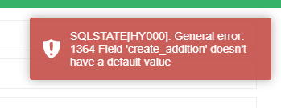
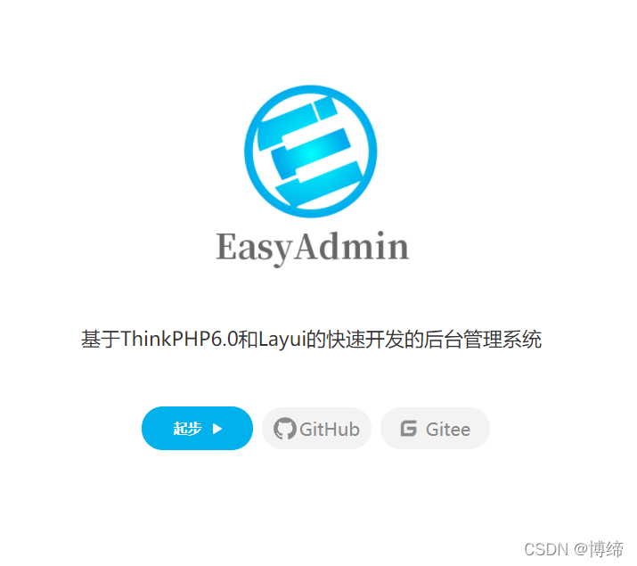

# 基础学习

[教程原生PHP+MySql实现后台数据的读取](https://www.cnblogs.com/cherishli/p/7077787.html)

[PHP简单获取数据库查询结果并返回JSON](https://www.cnblogs.com/xj76149095/p/5472333.html)


## 教程

1.PHP基础小白，https://www.bilibili.com/video/BV1A4411M7iA?p=6，从P10开始看
2.学框架，thinkphp6，https://space.bilibili.com/14978379/search/video?keyword=thinkphp
3.laravel 高级教程，找群主要。

4.Mysql，https://www.bilibili.com/video/BV1Vy4y1z7EX?p=148
5.Redis，https://www.bilibili.com/video/BV1CJ411m7Gc?p=36 ，看p1-p38

6.thinkphp实战，
https://www.bilibili.com/video/BV1C44y1x7ip?from=search&seid=3862886655798130840&spm_id_from=333.337.0.0
https://www.bilibili.com/video/BV1HA411M7ZW?from=search&seid=3862886655798130840&spm_id_from=333.337.0.0
https://www.bilibili.com/video/BV19p4y1D7S9?from=search&seid=3862886655798130840&spm_id_from=333.337.0.0
https://www.bilibili.com/video/BV1kf4y1877w?from=search&seid=7513740192011812637&spm_id_from=333.337.0.0


## 中后台管理的PHP框架

> 收藏一些中后台的管理开发框架，供以后的开发使用

https://codeigniter.org.cn/

可以聊天的PHP框架

http://wiki.linyiyuan.top/#/

https://learnku.com/articles/65044

laveral

1. 小型项目:Codelngiter
2. 中型项目:CakePHP、Zend Framework、Laravel、Thinkphp
3. 大型重量级项目:Yii、Symfony、Laravel


### 二、codeigniter框架，成熟的小框架。
https://codeigniter.org.cn/
### 一、Thinkphp框架
#### pearadmin框架
http://www.pearadmin.com/
#### FunAdmin框架
> 为梦想而创作：支持PHP8.0的系统
> FunAdmin 基于thinkphp6.X +Layui2.6.X + requirejs开发权限(RBAC)管理框架，框架中集成了权限管理、模块管理、插件管理、后台支持多主题切换、配置管理、会员管理等常用功能模块，以方便开发者快速构建自己的应用。框架专注于为中小企业提供最佳的行业基础后台框架解决方案，执行效率、扩展性、稳定性值得信赖，操作体验流畅，使用非常优化，欢迎大家使用及进行二次开发。

此框架功能强大，并且支持微信的功能。

https://www.funadmin.com/


#### 颜值在线的laytp框架
> 基于ThinkPHP6+LayUI的极速后台开发框架


[点我跳转](https://www.laytp.com/)

目前在使用CURD插件生成表的时候遇到了一个问题，不知道有没有大佬能给解答一下



### EasyAdmin

> 基于ThinkPHP6.0和Layui的快速开发的后台管理系统




[跳转链接](http://easyadmin.99php.cn/)

### 其他的
[这里面有很多框架](https://www.oschina.net/project/tag/464/backend)

### 二、Laravel框架
### 三、微信框架
### 1. Easywechat
https://www.easywechat.com/


### Laytp

生成curd的时候，浏览器点开禁用缓存。


### ex-admin

满足不同搭配开发人员场景

后端：php对象组件化代码开发

全栈：php对象组件化代码开发 + 自定义vue页面组件

前后端分离：php对象组件化代码开发 + 前端使用vue编译打包编写复杂页面

https://www.ex-admin.com/

## 笔记

[基础笔记](base.md)

[Composer教程](composer.md)

[PHP实现保留两位小数](https://www.php.cn/php-weizijiaocheng-389366.html)

### PHP日期时间的时间戳转换

```php
1.获取当前日期时间的时间戳   //1649637176
echo time();
获取当前日期时间
echo date("Y/m/d H:i:s");   //2022/04/11 00:32:56

2.日期转换为时间戳
echo strtotime(date("Y/m/d"));  //1649635200
时间戳转换为日期
echo date('Y-m-d',time());  //2022-04-11

3.打印明天此时的时间戳
echo strtotime("+1 day");   //1649723576
当前时间：
echo date("Y-m-d H:i:s",time()) ;   //2022-04-11 00:32:56
指定时间：
echo date("Y-m-d H:i:s",strtotime("+1 day")) ;    //2022-04-12 00:32:56

4.打印下个星期此时的时间戳
echo strtotime("+1 week");   //1650241976


5.打印指定下星期几的PHP时间戳
echo strtotime("next Thursday");  //1649894400
当前时间：
echo date("Y-m-d H:i:s",time());  //1649637176
指定时间： 
echo date("Y-m-d H:i:s",strtotime("next Thursday"));   //2022-04-14 00:00:00

6.打印指定上星期几的时间戳
echo strtotime("last Thursday");   //1649289600
当前时间：
echo date("Y-m-d H:i:s",time());   //2022-04-11 00:45:07
指定时间：
echo date("Y-m-d H:i:s",strtotime("last Thursday"));  //2022-04-07 00:00:00

```

### TP6框架导出text文本，数组转文本，分批分量导出。

```php

public function download(){
        $text = "";
        $data = array();

        $nums = 15000; //每次导出数量
        $step = V2::count() / $nums; //循环次数
        $url = "http://" . $_SERVER['SERVER_NAME'] . "/ver2?voucherCode=";
        if (!is_int($step)) {
            $step = intval($step) + 1;
        }
        for ($i = 0; $i < $step; $i++) {
            $start = $i * $nums;
            $result =  V2::field(['productcode','code'])
                ->limit($start, $nums)->select();
            foreach ($result as $item) {
                array_push($data,$url . $item['productcode'] . "    " . $item['code'] . PHP_EOL);
            }

        }
        $text=implode($data);
        return download($text,"123.txt", true);
    }
```

