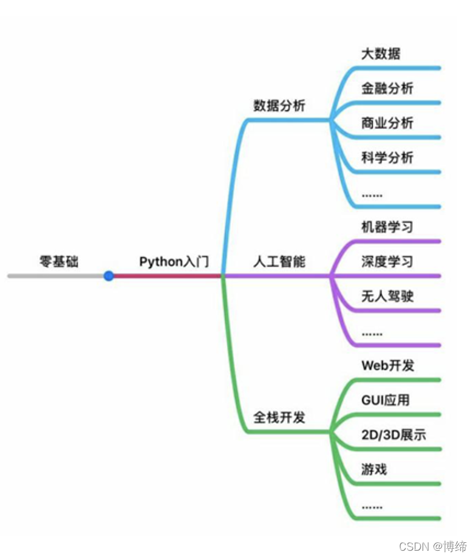
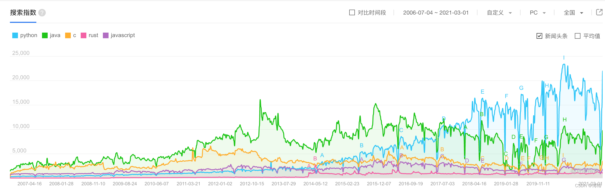
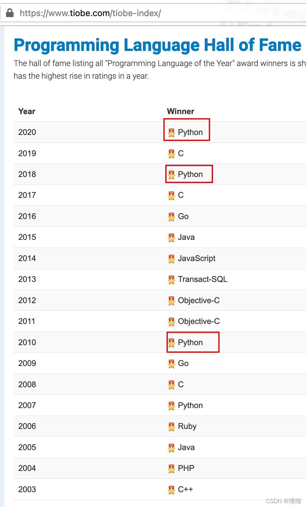

# Python

Python快速开发web

## 2.Python国内源

[目前参考这篇文章](https://www.cnblogs.com/sunnydou/p/5801760.html)

# 免费的分布式的自动化测试工具

http://www.selenium.org.cn/


# 什么是 Python？
Python 很好用
适合初学者
而且在各个领域都很强大

python3 早已有之
最终逆风翻盘
当然 java 也是非常伟大的对手


三次问鼎 tiobe 霸主之位
LinuxJournal
最喜欢的编程语言 2009-2011
最喜欢的脚本语言 2006-2008、2010、2011
LinuxQuestion.org
会员选择大奖 2007-2010

打开终端 terminal
运行 python3
更新 apt 源，安装 python3
打开 xfce(这个词的发音为X-f-c-e即四个字母一个一个的读)
进入终端

```bash
#首先是更新源
sudo apt update
#然后是安装Python
sudo apt install python3
#最后升级Python
sudo apt upgrade python3
```

退出
1. quit()
2. ctrl+d