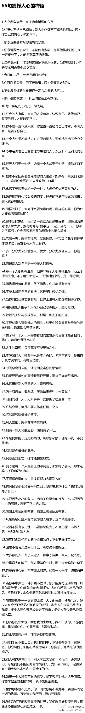

# 人生的一些感悟

1.如果你不给自己烦恼，别人也永远不可能给你烦恼。因为你自己的内心，你放不下。

2.没有天生就合适的两个人，需要彼此包容理解与改变。两个人在一起总得有一个高傲，一个低调；一个厉害，一个挨欺负；一个偷懒，一个勤快。懂得欣赏对方，感恩，珍惜才能看到长久！

3.时间会冲淡一切，没有过不去的事情，只有过不去的情绪。每个人都在人海茫茫中，学习并领悟思考人生。一辈子不长，要做好三件事：不自欺、不欺人、不被欺。那些得不到的，与之擦肩而过的，不必装作若无其事，哭就大放悲声，伤后痛定思痛，然后再往前走，前头总有风景。

4.人生没有白读的书，你触碰过的那些文字，会慢慢帮你认识这个世界，悄悄帮你抹去脸上的肤浅与无知，塑造出更有修养和德行的样子！

5.人生有许多东西需要放下，只有放下那些无谓的负担，我们才能一路潇洒前行，你每天的所得所失，如果你的心是快乐的，那么，你在哪里都是快乐的，如果你的心是喜悦的，那么，你做什么都是喜悦的，有时候决定我们心情的，不是别人，而是自己。

6.人生中出现的一切，都无法拥有，只能经历。深知这一点的人，就会懂得：无所谓失去，只是经过而已；无所谓失败，只是经验而已。用一颗浏览的心，去看待人生，一切的得与失、隐与显，都是风景与风情。

7.人生看淡了，不过是无常。生命里填塞的东西愈少，就越能体验到生命中的快乐。生命本是一次旅行，在每一次停泊时都要清理自己的口袋，把更多的位置空出来，让自己活得更轻松、更自在。

8.如果自己不够强大，再喜欢的东西放在你面前也无能为力，只能这样乖乖的看着。这就叫：心有鱼，而力不足！

9.天下万物的来和去，都有它的时间。上帝很忙，每天要安排那么多人相遇，他没时间等你茁壮成长，也根本没心思听你的温言软语，那些出现在你生命里的人，抓住了，就是你的，自己放手了，也别可惜。

10.要知道，你拥有的，就是最好的。不是因为一件东西好，你才千方百计去拥有它。而是因为你已拥有了它，才一心一意觉得它最好。苦和甜来自外界，体味幸福则来自内心。

11.人生有许多东西需要放下，只有放下那些无谓的负担，我们才能一路潇洒前行，你每天的所得所失，如果你的心是快乐的，那么，你在哪里都是快乐的，如果你的心是喜悦的，那么，你做什么都是喜悦的，有时候决定我们心情的，不是别人，而是自己。

12.人生如果没有跌落，就不会看清一些东西。你只有什么都不是了，才可以彻底感知人世的冷暖。好多人一下子散了，好些面孔一下子陌生了。你发现，比生活变得更快的，永远是人心。你也许会伤心一阵子。但生活以这样的方式，为你留下了这一辈子最值得交往的人。

13.来者要惜，去者要放。人生是一场旅行，不是所有人都会去向同一个地方。

小清新手绘图片山倒影水

14.生命中，相遇的人很多，相知的人并不多；生活里，相识的人很多，相依的人并不多，大千世界，并不是缺少一个说话的朋友，而是渴望一个理解自己，读懂自己的朋友，芸芸众生，并不是没有相识的朋友，而是渴求一个适合自己，体会自己的朋友。假如，生命中，有这样一个人出现了，你一定记住一个词：珍惜。

15.不要去反复思考同一个问题，不要把所有的感情都放在一个人身上，你还有父母，还有其他朋友。

16.真正的爱不是捆绑，好的感情是拉得开却扯不断的。拉得开就是彼此都拥有独立的人格、尊严和价值判断，而扯不断是说彼此之间的温暖和依恋。

17.有一些人的出现，就是来给我们开眼的。所以，人一定要禁得起假话，受得住敷衍，忍得住欺骗，忘得了承诺，放得下一切，别和傻逼讲道理，别跟人渣瞎逼逼。

18.很多人不快乐,因为总觉得过去太美好,现在太糟糕,将来又太飘渺。

19.你聪明，会有人说你心机重，你努力，会有人说你运气好，你天生乐观，会有人说你虚情假意。有时候，你明明就是一杯白水，却被人硬生生逼成了满肚子憋屈的碳酸饮料。人一生遇见太多人，只要内心澄明，就永远不用讨好一个不懂你的人。

20.人生是一种选择，亦是一种放弃。能自由选择的人是幸福的，能适度放弃的心是洒脱的。可惜，有时我们的选择，只有等待，没有结果，该离开就得离开；有时我们的放弃，迫于无奈，哪怕心中不舍，也只能决然的转身。所以，有些过去，关于幸福或伤痛，只能深埋心底；有些希冀，关于现在或将来，只能慢慢遗忘！

21.心情再差，也不要写在脸上，因为没有人喜欢看；日子再穷，也不要挂在嘴边，因为没有人无故给你钱；工作再累，也不要抱怨，因为没有人无条件替你干；生活再苦，也不要失去信念，因为美好将在明天；品性再坏，也要孝顺父母，因为你也有老的那天。人生哲理

22.我们生活在这个纷繁复杂的世界，不可能事事尽如人意。要控制自己的情绪，学会在夹缝中谋发展、求生存。只要有坚韧不拔的毅力，有能屈能伸的雅量，有不畏艰辛的精神，有吃苦耐劳的干劲，即使在恶劣环境下，依然可以让生命怒放。

23.人之所以累，是想要的太多；心之所以烦恼，是放下的太少。不去在意纷扰，不去忧虑明日，放下一切执念，素心如简，待莲花开尽后，便是清欢。人生路上，遇见善良，学会付出；遇见微笑，学会分享；遇见坎坷，学会勇敢。

励志图片男背影太阳

24.生活如水，平淡最美；记住，永远不要埋怨已经发生的事情，要么就改变它，要么就安静的接受它。人有个好的心态，才能享受人生。幸福很远亦很近，就看你用什么眼光看，用什么心态面对。

25.生活不可能像你想象得那么好，但也不会像你想象地那么糟。我觉得人的脆弱和坚强都超乎自己的想象。

26.用眼睛去看的，那是别人的故事，用心去感知的，那才是自己的人生。每一程都是风景，每一念都可以从容，直到岁月走过，你听，心海深处，花香正浓。

27.放弃该放弃的叫做成长，放弃不该放弃的叫做无奈，不放弃该放弃的叫做无知，不放弃不该放弃的叫做执着。

28.人生就好像一场戏，我们只知道这场戏的开头，却不知道这场戏的过程和结尾，但是还要我们去感受这戏的精彩，体验它的美好。

29.不是你的，就不要挽留；让你难受的，就别再将就。若人走情凉，就守心自暖；若聚散难免，便独享浮世清欢。从前不回头，往后不将就。这，才是你应该过的人生。

30.以前总认为坚持会让我们变强大，但是长大后发现，让我们强大的，是放下。

