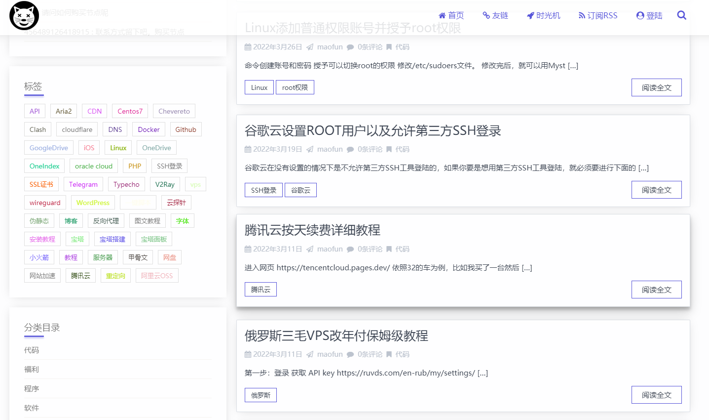

# 技术大牛的博客

## 全栈大佬

[方糖君](http://ftqq.com/)  ：代表作，方糖推送

[Mintimate's Blog](https://mintimate.cn/)：Mintimate's Blog为你我贡献经验，主要分享Linux的使用教程，同时也分享分享代码设计；偶尔荒腔走板聊聊Android、服务器以及程序员生活～～～

[dp2px](https://dp2px.com/)：物联网、vue、Springboot、python、安卓

[薛定喵君](https://www.ihewro.com/)：产品，商业，公众号、云开发、uniapp，vue，nodejs、逆向

[奇趣小罗](https://paul.ren/)：前后端技术

[友人C](https://www.ihewro.com/)：前段大佬，著有著名皮肤

[龙猫](https://totoro.site/)：django、生活、运维、小程序

[重前端、工具分享](https://www.cxyax.com/)：自由仁网络技术开发工作室

## 前端大佬

[**峰华前端工程师**](https://zxuqian.cn/)：致力于帮助你以最直观、最快速的方式学会前端开发，并希望我的个人经历对你有所启发。点击查看最新[技术视频教程、](https://zxuqian.cn/videos)[实战课程、](https://zxuqian.cn/course/react-chat-ui)[技术博客、](https://zxuqian.cn/#homepage_blogs)[前端资源导航、](https://zxuqian.cn/resources)以及我的[想法和生活点滴](https://zxuqian.cn/lifestyle)。“峰华前端工程师”账号创作者/[《JavaScript 基础语法详解》作者](https://zxuqian.cn/books/javascript-syntax-guide)

https://www.zhangqinblog.com/learnShare/  ：前端大佬，做的博客分享。

## 偏向后端PHP、Go、java

### PHP

[腾讯云COS优化网站 – 技术松鼠](https://www.jishusongshu.com/)：分享各种高效率电脑软件,编程知识,程序源码,建站经验,网络技术,手机应用,硬件知识,Office技巧,PS插件,美工资源等各类教程,致力创造一个高质量的技术分享平台.微信公众号【技术松鼠】的网站.

https://www.kancloud.cn/lengyueguang/linux/561517

[梁高强的博客](https://blog.lgqhealer.cn/)

[王娇的php中文网博客](https://www.php.cn/blog/wangjiao.html)

[cms博客,御宅男博客](https://blog.yzncms.com/)：cms博客,御宅男博客,个人博客,php个人博客,个人技术博客,博客系统,技术分享博客,程序员博客,技术分享博客,技术博主,优秀个人博客,个人博客网站,yzncms博客, 个人博客网站模板

### Java

[天乔巴下](https://tqbx.gitee.io/javablog/#/)：Java天才研究生

[Echo Blog](https://houbb.github.io/)  ：Java大佬

[宋子宪博客](https://songzixian.com/)：Java的小博客

[陌溪的学习笔记：](http://note.moguit.cn/#/README?id=java)面试突击宝典，主要来源于B站上视频的学习，同时会记录平时一些学习和项目中遇到的问题，同步更新在蘑菇博客，如果对我的博客网站感兴趣的话，欢迎关注我的 蘑菇博客项目 笔记主要涵盖：Java，Spring，SpringCloud，计算机网络，操作系统，数据结构，Vue等 

[JAVA博客园](https://www.zhixun.cc/blog/home) 永远相信美好的事情即将发生

[蘑菇社区](http://www.moguit.cn/) ：一键搭建蘑菇社区

### Golang

## 偏向物联网

[生子当如哈士奇的个人博客](https://www.scaugreen.cn/posts/44755/)：esp8266、3D可视化，综合类教程，神通广大。

[krunk](https://krunk.cn/)：物联网、前端大牛、VUE、爬虫、上海，博客的UI做的前无古人。简直就是绝世芳华。

## 偏向工具类

[随机笔记](http://blog.520.fi/category/software)：软件分享、强电、物联网

[Sianx's ](https://www.sianx.com/page/2/#content-inner)：学生、前段、刷网课脚本

## 偏向爬虫

[玩客E族](https://www.playezu.com/)：爬虫、软件测试

## 偏向机器学习

[机器视觉全栈er](http://www.cvtutorials.com/#/)：专注于机器视觉领域

## 偏向生活

[禾令奇 - 记录生活，细说爱情](https://www.helingqi.com/)：禾令奇,情侣博客网站,禾令取自我和她的名字,奇是给未来的她留的.我们用禾令奇来记录我俩相识,相恋过程中的点点滴滴.记录生活,留住爱和美好回忆.

[三无青年 | 段先森的个人博客：](https://www.duanxiansen.com/)本博客主要是记录生活。像是自己的一个记事本。文采不行，只是乱七八糟的吐槽。建了一个[博客圈](https://bokequan.net/)，收集一些个人独立博客，没有纯技术，只有纯生活。
欢迎爱记录生活的你加入。（QQ群：973454323）

## 偏向运维

[思有云](https://www.ioiox.com/)：群辉、frp、生活、折腾家用路由器

[沉冰浮水](https://www.wdssmq.com/)：linux文档、有趣的生活

[猫饭](https://maofun.com/)：偏向运维，青龙面板

[向晚阳光](https://www.timelate.com/)：免流啊，闲置服务器安装小项目

[IT浪子の博客](https://www.itlangzi.com/):⭐IT浪子の博客,Home,IT浪子技术博客, IT浪子, 浪子, 个人博客, Java 博客, Golang 博客

[图库](https://www.itlangzi.com/gallery.html)[视频](https://www.itlangzi.com/s/video.html)[音乐](https://www.itlangzi.com/s/music.html)[toc-helper](https://www.itlangzi.com/s/tochelper.html)

[🕊️Lam's Blog](https://www.imlam.com/)：梯子、免流、脚本、手机卡

## 参考博客建设

[小李子的blog：](https://www.lbyxlz.com/)小李子的blog - 来自扑街学生的优质软件、教程分享

[懒人脸萌-分享快乐(www.xiaonuozi.com)](https://www.xiaonuozi.com/)：懒人脸萌,小诺子,妹子图,美图壁纸,网站源码,源码教程,绿色资源网,软件分享,影视预告,,影视推荐,最新预告,中文字幕,阿里云盘,天翼云盘,迅雷云盘,天翼云解析,百度网盘

