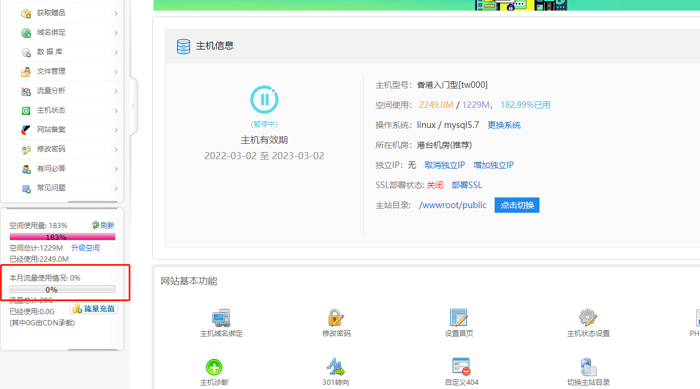

# 建站资源：推荐购买的域名、虚拟主机、服务器，CDN等

## 待处理

### 1. 基于python+openCV+flask的实时移动检测ALL

最近手痒，就造了个轮子。名字随意一点，就叫**rtm2**吧, real-time motion moitior.
 算是一个实时移动侦测程序，主要使用python+flask+[socketIO](https://links.jianshu.com/go?to=https%3A%2F%2Fsocket.io%2F)+openCV开发。

与类似程序的不同在于，rtm2只在检测到运动🏃的时候才推送视频帧给客户端。
 服务端为树莓派、笔记本等带有摄像头的设备，在上面运行openCV和flask。
 openCV负责抓取视频帧和比较视频帧之间的区别。发现区别后通过websocket把结果实时发送给浏览器，这样可以避免不必要的数据传输。
 如果没有发现运动，就发送心跳包，告知浏览器等客户端通信正常。
 检测到移动或通信异常时通过弹框、声音、震动（如手机等移动设备）等方式提醒用户。
 移动侦测到的结果会存储在服务器上（可选），在网页上可以查看移动帧的历史情况。

作者：def_fun
链接：https://www.jianshu.com/p/585f0ac00a19

## 一键自动化部署空间服务商，在线vue代码托管 devops什么的

https://www.netlify.com/：把它们放在一起，结合您最喜欢的工具和 API 以构建最快的 Web 站点、商店和应用程序的最快方式。

## 2.量子计算架构  https://www.dwavesys.com/

[又拍云 + WordPress + 图床 – 技术松鼠](https://www.jishusongshu.com/wordpress-site/upyun-figure-bed/)

## CDN分发网络

[多吉云](https://www.dogecloud.com/)：DogeCloud 强大易用的企业级视频应用引擎,多吉云

一站式视频云点播平台，轻量级的用户能够无需了解任何技术就轻而易举地展示和播放视频，而以视频为主要产品的用户能通过强大的 API 和 SDK 完成对视频的高级处理。

[又拍云CDN](https://www.upyun.com/)

[七牛云CDN](https://www.qiniu.com/)

## 2.1，常见cdn网站

- 国内

  - [BootCDN（猫云）：https://www.bootcdn.cn/#about](https://links.jianshu.com/go?to=https%3A%2F%2Fwww.bootcdn.cn%2F%23about)
  - [Staticfile CDN（七牛云）：http://staticfile.org](https://links.jianshu.com/go?to=http%3A%2F%2Fstaticfile.org)

- 国外

  - [UNPKG：https://unpkg.com](https://links.jianshu.com/go?to=https%3A%2F%2Funpkg.com)
  - [jsDelivr ：https://www.jsdelivr.com](https://links.jianshu.com/go?to=https%3A%2F%2Fwww.jsdelivr.com)

  

## 西部数码虚拟空间安装Thinkphp
linux转win，之后，再转回去，就要付30元的服务费。联系技术专家免费更换。

西部数码可以直接安装tp的框架，只要是linux版本都支持

香港主机如果不买dns，访问非常慢。

## 低代码开发平台

### 1. 无远开发平台

[Enhancer,enhancer,无远开发平台,PAAS,Paas,开发平台,快速开发平台,Dev Platform,Cloud Development,低代码,lowcode](https://wuyuan.io/)

Enhancer 是专业的一站式信息系统开发云平台。绝大多数情况下，您只需编写 SQL，无需编写代码，即可快速完成各类系统的开发，并且获得可直接部署在您私有环境的应用程序。极大降低您的开发、运维、迭代成本。

